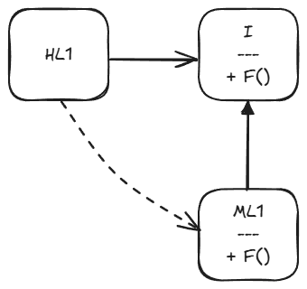
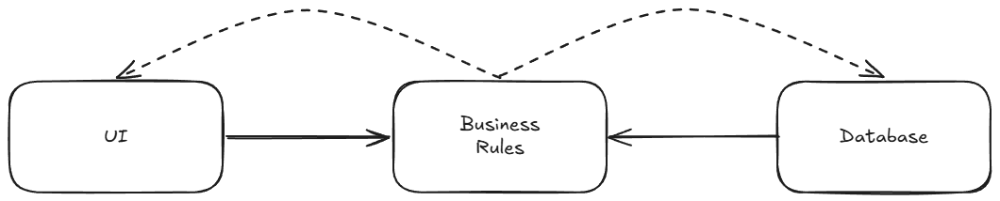

# 05장 객체 지향 프로그래밍

좋은 아키텍처를 만드는 일은 객체 지향(Object-Oriented, OO) 설계 원칙을 이해하고 응용하는 데서 출발한다.  
OO는 대체 무엇인가?

누군가는 "데이터와 함수의 조합"이라고 답할 수 있다.  
대체로 이런 방식으로 많이 설명되지만 만족스럽지 않은데,

o.f()가 f(o)와 다르다는 의미를 내포하기 때문에 이는 터무니없는 말이다.

달과 니가드가 함수 호출 스택 프레임을 힙으로 옮기고 OO를 발명한 1966년보다 훨씬 이전부터 프로그래머는 데이터 구조를 함수에 전달해 왔다.

또는 이 질문에 흔히 "실제 세계를 모델링하는 새로운 방법"이라고들 답한다.  
이는 기껏해야 얼버무리는 수준에 지나지 않는다.

실제 세계를 모델링한다 라는 말이 무엇을 의미하는지도 불분명하며, 정의가 너무 모호하다.

OO의 본질을 설명하기 위해 세 가지 주문에 기대는 부류도 있는데,  
캡슐화(encapsulation), 상속(inheritance), 다형성(polymorphism)이 바로 그 주문이다.

## 캡슐화?

OO를 정의하는 요소 중 하나로 캡슐화를 언급하는 이유는 데이터와 함수를 쉽고 효과적으로 캡슐화 하는 방법을 OO 언어가 제공하기 때문이다.

구분선 바깥에서 데이터는 은닉되고, 일부 함수만이 외부에 노출된다.

하지만 이러한 개념이 OO에만 국한된 것은 아니다. C 언어에서도 완벽한 캡슐화가 가능하다.

```C
// point.h

struct Point;
struct Point* makePoint(double x, double y);
double distance (struct Point *p1, struct Point *p2);
```

```C
// point.c

#include "point.h"
#include <stdlib.h>
#include <math.h>

struct Point {
    double x, y;
};

struct Point* makePoint(double x, double y) {
    struct Point* p = malloc(sizeof(struct Point));
    p->x = x;
    p->y = y;
    return p;
}

double distnace(struct Point* p1, struct Point* p2) {
    double dx = p1->x - p2->x;
    double dy = p1->y - p2->y;
    return sqrt(dx*dx+dy*dy);
}
```

point.h를 사용하는 측에서 struct Point의 멤버에 접근할 방법이 전혀 없다.  
사용자는 makePoint() 함수와 distance() 함수를 호출할 수는 있지만, Point 구조체의 데이터 구조와 함수가 어떻게 구현되었는지에 대해서는 조금도 알지 못한다.

보다시피 OO가 아닌 언어에서도 충분히 가능하다.

이후 C++라는 형태로 OO가 등장했고, C++ 컴파일러는 기술적인 이유로 클래스의 멤버 변수를 해당 클래스의 헤더 파일에 선언할 것을 요구했다.

이제 point.h 헤더 파일을 사용하는 측에서는 멤버 변수인 x와 y를 알게 된다.  
캡슐화가 깨진 것이다.

자바와 C#은 헤더와 구현체를 분리하는 방식을 모두 버렸고, 이로 인해 캡슐화는 더욱 심하게 훼손되었다. 이들 언어에서는 클래스 선언과 정의를 구분하는 게 아예 불가능하다.

이 때문에 OO가 강력한 캡슐화에 의존한다는 정의는 받아들이기 힘들다.  
실제로 많은 OO 언어가 캡슐화를 거의 강제하지 않는다.  
OO를 제공한다고 주창한 언어들이 실제로는 C 언어에서 누렸던 완벽한 캡슐화를 약화시켜 온 것은 틀림없다...?

### 내 생각

그렇다고 C의 캡슐화가 Java의 캡슐화보다 강하다고 할 수는 없을 것 같은데..  
저자가 말하는 것처럼 C에서 헤더를 나누면 필드가 선언된다는 사실 자체가 보이지 않겠지만

이건 개발자의 선택인 것 같고. 자바는 접근 제한자가 언어 차원에서 은닉을 강제하니까

## 상속?

OO 언어가 더 나은 캡슐화를 제공하지는 못했지만, 상속만큼은 OO 언어가 확실히 제공했다.  
-> 얼추 맞는 말이다.

하지만 상속이란 단순히 어떤 변수와 함수를 하나의 유효 범위로 묶어서 재정의하는 일에 불과하다.  
사실상 OO 언어가 있기 훨씬 이전에도 C(또는 다른 언어) 프로그래머는 언어의 도움 없이 손수 이러한 방식으로 구현할 수 있었다.

```C
// namedPoint.h

struct NamedPoint;

struct NamedPoint* makeNamedPoint(double x, double y, char* name);
void setName(struct NamedPoint* np, char* name);
char* getName(struct NamedPoint* np);
```

```C
// namedPoint.c

#include "namedPoint.h"
#include <stdlib.h>

struct NamedPoint {
    double x, y;
    char* name;
};

struct NamedPoint* makeNamedPoint(double x, double y, char* name) {
    struct NamedPoint* p = malloc(sizeof(struct NamedPoint));
    p->x = x;
    p->y = y;
    p->name = name;
    return p;
}

void setName(struct NamedPoint* np, char* name) {
    np->name = name;
}

char* getName(struct NamedPoint* np) {
    return np->name;
}
```

```C
// main.c

#include "point.h"
#include "namedPoint.h"
#include <stdio.h>

int main(int ac, char** av) {
    struct NamedPoint* origin = makeNamedPoint(0.0, 0.0, "origin");
    struct NamedPoint* upperRight = makeNamedPoint(1.0, 1.0, "upperRight");

    printf("distance=%f\n",
        distance(
            (struct Point*) origin,
            (struct Point*) upperRight));
}
```

main.c를 보면, NamedPoint 데이터 구조가 마치 Point 데이터 구조로부터 파생된 것처럼 동작한다는 사실을 볼 수 있다.  
NamedPoint에 선언된 두 변수의 순서가 Point와 동일하기 때문

OO가 출현하기 이전부터 프로그래머가 흔히 사용하던 스킬이었음.

## 다형성?

OO 언어 이전에도 다형성을 표현할 수 있는 언어는 있었다.

```C
#include <stdio.h>

void copy() {
    int c;
    while ((c=getchar()) != EOF) {
        putchar(c);
    }
}
```

getchar() 함수는 STDIN에서 문자를 읽는다.  
putchar() 함수는 STDOUT으로 문자를 쓴다.

C는 어떤 방식으로 문자를 읽는 장치 드라이버를 호출할 수 있는가?

유닉스 운영체제는 모든 입출력 장치 드라이버가 다섯 가지 표준 함수

- open
- close
- read
- write
- seek

를 제공할 것을 요구한다.

FILE 데이터 구조는 이 다섯 함수를 가리키는 포인터들을 포함한다.

```C
struct FILE {
    void (*open)(char* name, int mode);
    void (*close)();
    int (*read)();
    void (*write)(char);
    void (*seek)(long index, int mode);
}
```

이제 STDIN을 FILE\*로 선언하면 STDIN은 콘솔 데이터 구조를 가리키므로

```C
extern struct FILE* STDIN;

int getchar() {
    return STDIN->read();
}
```

getchar()는 STDIN으로 참조되는 FILE 데이터 구조의 read 포인터가 가리키는 함수를 단순히 호출할 뿐이다.

함수를 가리키는 포인터를 응용한 것이 다형성이라는 점이다.  
다만 함수 포인터로 다형성을 직접 구현하는 것이 위험하기 때문에

OO 언어는 다형성을 좀 더 안전하고 편리하게 사용할 수 있게 해준다.  
OO 는 제어흐름을 간접적으로 전환하는 규칙을 부과한다고 결론지을 수 있다.

### 다형성이 가진 힘

다형성이 왜 좋은가?

copy() 함수를 다시 살펴보자.  
새로운 입출력 장치가 생긴다면 프로그램에는 어떤 변화가 생기는가?

아무런 변경도 필요 없다.. 복사 프로그램을 다시 컴파일할 필요도 없다.  
다시 말해 입출력 드라이버가 복사 프로그램의 플러그인이 된 것이다.

플러그인 아키텍처는 이처럼 장치 독립성을 지원하기 위해 만들어졌지만, 대다수의 프로그래머는 함수 포인터가 위험하기 때문에 이 개념을 적용하지 않아왔었다.

OO의 등장으로 언제 어디서든 플러그인 아키텍처를 적용할 수 있게 되었다.

### 의존성 역전

다형성을 안전하고 편리하게 적용할 수 잇는 메커니즘 등장 전  
전형적인 호출 트리의 경우 main 함수가 고수준 함수를 호출하고, 고수준 함수는 다시 중간 수준 함수를 호출, 중간 수준 함수는 저수준 함수를 호출한다.

소스 코드 의존성의 방향은 반드시 제어흐름을 따르게 된다.

하지만 다형성이 끼어들면



HL1 모듈은 ML1 모듈의 F() 함수를 호출한다. 소스 코드에서는 HL1 모듈은 인터페이스를 통해 F() 함수를 호출한다.  
이 인터페이스는 런타임에는 존재하지 않는다.

하지만 ML1과 I 사이의 소스 코드 의존성이 제어흐름과는 반대인 점을 주목하자.  
이는 의존성 역전(dependency inversion)이라고 부르며, 소프트웨어 아키텍트 관점에서 이러한 현상은 심오한 의미를 갖는다.

OO 언어로 개발된 시스템을 다루는 소프트웨어 아키텍트는 시스템의 소스 코드 의존성 전부에 대해 방향을 결정할 수 있는 절대적 권한을 갖는다.

이것이 OO가 가진 힘이고 이것이 바로 OO가 지향하는 것이다.

그럼 이 힘으로 무엇을 할 수 있는가?



-> 업무 규칙이 데이터베이스와 사용자 인터페이스에 의존하는 대신에,  
시스템의 소스 코드 의존성을 반대로 배치하여 데이터베이스와 UI가 업무 규칙에 의존하게 만들 수 있다.

따라서 업무 규칙을 UI와 데이터베이스와는 독립적으로 배포할 수 있다.  
UI나 데이터베이스에서 발생한 변경사항은 업무 규칙에 일절 영향을 미치지 않는다.

특정 컴포넌트의 소스 코드가 변경되면, 해당 코드가 포함된 컴포넌트만 다시 배포하면 된다.  
이것이 배포 독립성(independent deployability)이다.

시스템의 모듈을 독립적으로 배포할 수 있게 되면, 서로 다른 팀에서 각 모듈을 독립적으로 개발할 수 있다.  
그리고 이것이 개발 독립성(independent developability)이다.

## 결론

OO란 무엇인가?  
소프트웨어 아키텍트 관점에서의 정답은 명확하다.

OO란 다형성을 이용하여 전체 시스템의 모든 소스 코드 의존성에 대한 절대적인 제어 권한을 획득할 수 있는 능력이다.

OO를 사용하면 아키텍트는 플러그인 아키텍처를 구성할 수 있고, 이를 통해 고수준의 정책을 포함하는 모듈은 저수준의 세부사항을 포함하는 모듈에 대해 독립성을 보장할 수 있다.

저수준의 세부사항은 중요도가 낮은 플러그인 모듈로 만들 수 있고, 고수준의 정책을 포함하는 모듈과는 독립적으로 개발하고 배포할 수 있다.
