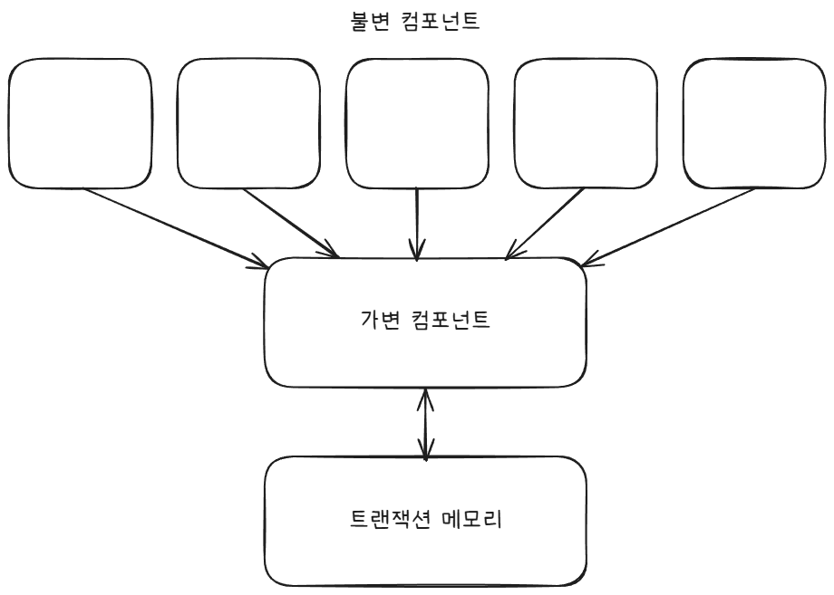

# 06장 함수형 프로그래밍

함수형 프로그래밍이라는 개념은 프로그래밍 그 자체보다 앞서 등장했다.  
이 패러다임에서 핵심이 되는 개념은 람다 계산법으로, 알론조 처치(Alonzo Church)가 1930년대 발명했다.

## 정수를 제곱하기

25까지의 정수의 제곱을 출력하는 간단한 문제

```java
public Class Squint {
    public static void main(String[] args) {
        for(int i = 0; i < 25; i++) {
            System.out.println(i*i);
        }
    }
}
```

리스프에서 파생한 클로저는 함수형 언어로, 다음과 같이 구현할 수 있다.

```Clojure
(println (take 25 (map (fn [x] (* x x)) (range))))
```

println, take, map, range는 모두 함수다. 리스프에서는 함수를 괄호 안에 넣는 방식으로 호출한다.

표현식 (fn [x] (\* x x)) 는 익명 함수로, 곱셈 함수를 호출하면서 입력 인자를 두 번 전달한다.(입력의 제곱)

자바 프로그램은 가변 변수(mutual variable)를 사용하는데, 가변 변수는 프로그램 실행 중에 상태가 변할 수 있다. 예제에서 i가 가변 변수다.  
클로저 프로그램에서는 이러한 가변 변수가 전혀 없다.  
클로저에서는 x와 같은 변수가 한 번 초기화되면 절대로 변하지 않는다.

함수형 언어에서 변수는 변경되지 않는다.

## 불변성과 아키텍처

아키텍처를 고려할 때 이러한 내용이 왜 중요한가?  
아키텍트는 왜 변수의 가변성을 염려하는가?

경합(race) 조건, 교착상태(deadlock), 동시 업데이트(concurrent update) 문제가 모두 가변 변수로 인해 발생하기 때문이다.

다시 말해 우리가 동시성 애플리케이션에서 마주치는 모든 문제, 다수의 스레드와 프로세스를 사용하는 애플리케이션에서 마주치는 모든 문제는 가변 변수가 없다면 절대로 생기지 않는다.

아키텍트라면 동시성(concurrency) 문제에 지대한 관심을 가져야만 한다.  
스레드와 프로세스가 여러 개인 상황에서도 설계한 시스템이 여전히 강건하기를 바란다.

하지만 자원이 무한대가 아니라면 완전한 불변성 확보는 어렵다.  
일종의 타협을 해야 한다.

## 가변성의 분리

가장 주요한 타협 중 하나는 애플리케이션, 또는 애플리케이션 내부의 서비스를 가변 컴포넌트와 불변 컴포넌트로 분리하는 일이다.

불변 컴포넌트는 변수의 상태를 변경할 수 있는, 순수 함수형 컴포넌트가 아닌 하나 이상의 다른 컴포넌트와 서로 통신한다.



상태 변경은 컴포넌트를 갖가지 동시성 문제에 노출하게 되므로, 흔히 트랜잭션 메모리 같은 실천법을 사용하여 동시 업데이트와 경합 조건 문제로부터 가변 변수를 보호한다.

간단한 예로 클로저의 atom 기능을 들 수 있다.

```Clojure
(def counter (atom 0))  ; counter를 0으로 초기화
(swap! counter inc)     ; counter를 안전하게 증가시킨다.
```

atom은 특수한 형태의 변수로, 값을 변경하려면 반드시 swap! 함수를 사용해야 한다.  
swap 함수는 전통적인 compare and swap 알고리즘 전략을 사용한다.

요지는, 애플리케이션을 제대로 구조화하려면 가변 컴포넌트와 불변 컴포넌트를 분리해야 한다는 것이다.  
그리고 가변 변수들을 보호하는 적절한 수단을 동원해야 한다.

## 이벤트 소싱

하드웨어의 성능이 개선될수록, 필요한 가변 상태는 더 적어진다.

고객의 계좌 잔고를 관리하는 은행 애플리케이션을 생각해보자.  
입금 트랜잭션과 출금 트랜잭션이 실행되면 잔고를 변경해야 한다.  
이제 계좌 잔고를 변경하는 대신 트랜잭션 자체를 저장한다고 상상해보자.

누군가 잔고 조회를 요청할 때마다 계좌 개설 시점부터 발생한 모든 트랜잭션을 단순히 더한다.  
이 전략에서는 가변 변수가 하나도 필요 없다.

당연하게도 이러한 접근법은 터무니 없다.  
시간이 지날수록 트랜잭션 수는 끝없이 증가하고, 잔고 계산에 필요한 컴퓨팅 자원은 걷잡을 수 없이 커진다.  
이 전략이 영원히 실현 가능하려면 무한한 저장 공간과 무한한 처리 능력이 필요하다.

이벤트 소싱(event sourcing)에 깔려 있는 기본 발상이 바로 이것이다.  
이벤트 소싱은 상태가 아닌 트랜잭션을 저장하자는 전략이다.

물론 지름길을 택할 수도 있다. 예를 들어 매일 자정에 상태를 계산한 후 저장한다.  
상태가 필요해지면 단순히 상태의 시작점부터 모든 트랜잭션을 처리한다.

결과적으로 애플리케이션은 CRUD가 아니라 그저 CR만 수행한다.  
데이터 저장소에서 변경과 삭제가 전혀 발생하지 않으므로 동시 업데이트 문제 또한 일어나지 않는다.

저장 공간과 처리 능력이 충분하면 애플리케이션이 완전한 불변성을 갖도록 만들 수 있고, 완전한 함수형으로 만들 수 있다.

## 결론

- 구조적 프로그래밍은 제어 흐름의 직접적인 전환에 부과되는 규율이다.
- 객체 지향 프로그래밍은 제어 흐름의 간접적인 전환에 부과되는 규울이다.
- 함수형 프로그래밍은 변수 할당에 부과되는 규율이다.

각 패러다임은 우리가 코드를 작성하는 방식의 형태를 한정시킨다.  
반세기동안 우리가 배운 것은 해서는 안 되는 것에 대해서다.

소프트웨어는 급격히 발전하는 기술이 아니라는 진실과 마주하게 된다....  
1946년 앨런 튜링이 전자식 컴퓨터에서 실행할 거의 최초의 코드를 작성할 때 사용한 소프트웨어 규칙과 지금의 소프트웨어 규칙은 조금도 다르지 않다.
