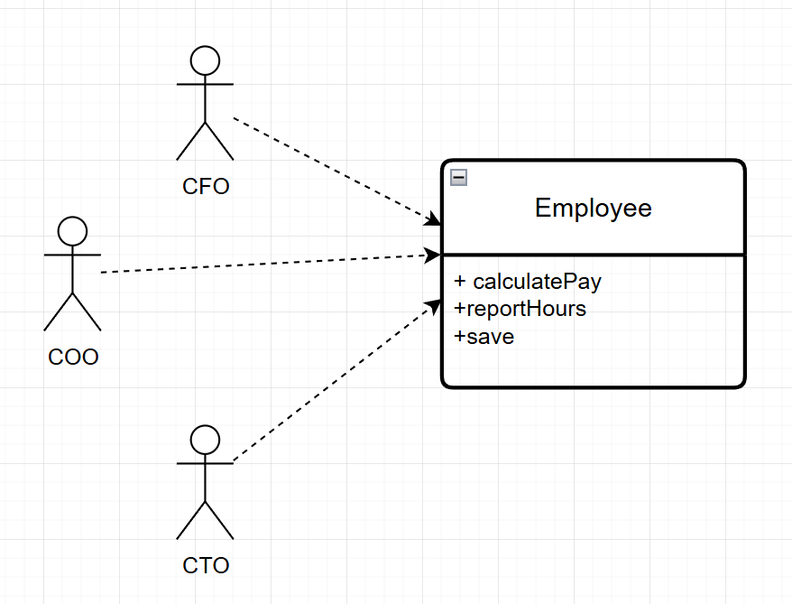
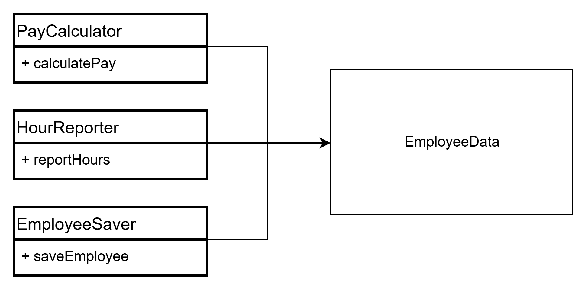
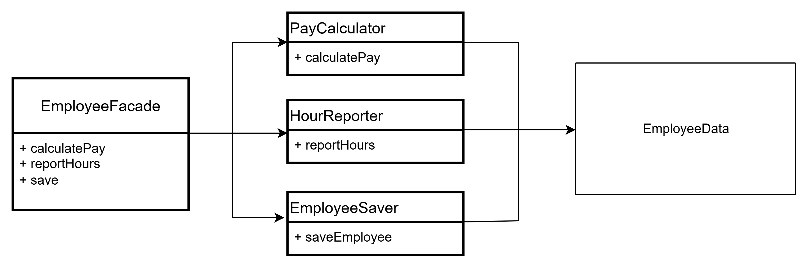

# 07장 SRP: 단일 책임 원칙

의미와 이름이 사실 잘 맞지 않는다.  
프로그래머가 이 원칙의 이름을 듣는다면 모든 모듈이 단 하나의 일만 해야 한다는 의미로 받아들이기 쉽다 (헉)

헷갈리지 마라. 단 하나의 일만 해야 한다는 원칙은 함수에 적용되는 것이다.  
이것은 SOLID 원칙이 아니며, SRP도 아니다.

역사적으로 SRP는

> 단일 모듈은 변경의 이유가 오직 하나뿐이어야 한다.

로 기술되어 왔다.  
SRP가 말하는 '변경의 이유'란 바로 사용자와 이해관계자를 가리킨다.

사실 시스템이 동일한 방식으로 변경되기를 원하는 사용자나 이해관계자가 두 명 이상일 수 있기 때문에 해당 변경을 요청하는 한 명 이상의 사람들을 묶어 '액터 actor'라고 부르겠다.

따라서 SRP는 아래와 같이 바꿔 말할 수 있다.

> 하나의 모듈은 오직 하나의 액터에 대해서만 책임져야 한다.

그렇다면 모듈은 무엇인가?

모듈은 함수와 데이터 구조로 구성된 응집된 집합이다.

응집된(cohesive) 이라는 단어가 SRP를 암시한다. 단일 액터를 책임지는 코드를 함께 묶어주는 힘이 바로 응집성(cohesion)이다.

## 징후1: 우발적 중복



이 클래스는 SRP를 위반하는데, 세 가지 메서드가 서로 매우 다른 세 명의 액터를 책임지기 때문이다.

- calculatePay() 메서드는 회계팀에서 기능을 정의하며, CFO 보고를 위해 사용한다.
- reportHour() 메서드는 인사팀에서 기능을 정의하고 사용하며, COO 보고를 위해 사용한다.
- save() 메서드는 데이터베이스 관리자가 기능을 정의하고, CTO 보고를 위해 사용한다.

개발자가 이 세 메서드를 Employee라는 단일 클래스에 배치하여 세 액터가 서로 결합되어 버렸다.  
이 결합으로 인해 CFO 팀에서 결정한 조치가 COO 팀이 의존하는 무언가에 영향을 줄 수 있다.

예를 들어 calculatePay() 메서드와 reportHours() 메서드가 초과 근무를 제외한 업무 시간을 계산하는 알고리즘을 공유한다고 해보자.

CFO 팀에서 초과 근무를 제외한 업무 시간을 계산하는 방식을 약간 수정하기로 결정했다..  
COO 팀에서는 이러한 일이 벌어지고 있다는 사실을 알지 못한다.

마침내 문제가 발견되면 COO는 격노한다. 잘못된 데이터로 인해 수백만 달러의 예산이 지출되었기 때문이다..

SRP는 서로 다른 액터가 의존하는 코드를 서로 분리하라고 말한다.

## 징후2: 병합

소스파일에 다양하고 많은 메서드를 포함하면 병합이 자주 발생할 것이다.  
특히 이들 메서드가 서로 다른 액터를 책임진다면 병합이 발생할 가능성은 확실히 더 높다.

예를 들어 DBA가 속한 CTO 팀에서 데이터베이스의 Employee 테이블 스키마를 약간 수정하기로 결정했다고 해보자.  
동시에 인사 담당자가 속한 COO 팀에서는 repeatHours() 메서드의 보고서 포맷을 변경하기로 결정했다고 해보자.

두 명의 서로 다른 개발자가 Employee 클래스를 체크아웃 받은 후 변경사항을 적용하기 시작한다.  
안타깝게도 충돌하고, 병합이 발생한다...

이 예에서 발생한 병합은 CTO와 COO 모두를 곤경에 빠뜨린다.

이 문제를 벗어나는 방법은 서로 다른 액터를 뒷받침하는 코드를 서로 분리하는 것이다.

## 해결책

이 문제의 해결책은 다양한데, 모두 메서드를 각기 다른 클래스로 이동시키는 방식이다.

아무런 메서드가 없는 간단한 데이터 구조인 EmployeeData 클래스를 만들어, 세 개의 클래스가 공유하도록 한다.



각 클래스는 자신의 메서드에 반드시 필요한 소스 코드만을 포함한다.  
세 클래스는 서로의 존재를 몰라야 한다. 그래야 '우연한 중복'을 피할 수 있다.

반면 이 해결책은 개발자가 세 가지 클래스를 인스턴스화하고 추적해야 한다는 게 단점이다.  
이럴 때 흔히 쓰는 기법으로 퍼사드(Facade) 패턴이 있다.



EmployeeFacade에 코드는 거의 없다.  
이 클래스는 세 클래스의 객체를 생성하고, 요청된 메서드를 가지는 객체로 위임하는 일을 책임진다.

어떤 개발자는 가장 중요한 업무 규칙을 데이터와 가깝게 배치하는 방식을 선호한다.  
이 경우라면 가장 중요한 메서드는 기존의 Employee 클래스에 그대로 유지하되, Employee 클래스를 덜 중요한 나머지 메서드들에 대한 퍼사드로 사용할 수도 있다.

```java
// ——— 도메인 모델 ———
public record Employee(EmployeeId id, String name, Money hourlyWage, List<WorkLog> workLogs) {}

// ——— 역할 인터페이스 ———
public interface PayCalculator { Money calculatePay(Employee e); }
public interface HourReporter  { String reportHours(Employee e); }
public interface EmployeeSaver { void save(Employee e); }

// ——— 구체 구현 ———
public final class DefaultPayCalculator implements PayCalculator {
  @Override public Money calculatePay(Employee e) { /* ... */ return Money.of(123_000); }
}
public final class DefaultHourReporter implements HourReporter {
  @Override public String reportHours(Employee e) { /* ... */ return "40h"; }
}
public final class JdbcEmployeeSaver implements EmployeeSaver {
  @Override public void save(Employee e) { /* insert/update ... */ }
}

// ——— 퍼사드 ———
public final class EmployeeFacade {
  private final PayCalculator payCalc;
  private final HourReporter reporter;
  private final EmployeeSaver saver;

  // DI(생성자 주입) 권장: 테스트와 교체가 쉬움
  public EmployeeFacade(PayCalculator pc, HourReporter hr, EmployeeSaver es) {
    this.payCalc = pc; this.reporter = hr; this.saver = es;
  }

  public Money calculatePay(Employee e) { return payCalc.calculatePay(e); }
  public String reportHours(Employee e) { return reporter.reportHours(e); }
  public void save(Employee e) { saver.save(e); }
}
```


```java
Employee e = new Employee(...); // 직원 데이터

HourReporter reporter = new HourReporter();
reporter.reportHours(e);

EmployeeSaver saver = new EmployeeSaver();
saver.saveEmployee(e);

e.calculatePay();
```

모든 클래스는 반드시 단 하나의 메서드를 가져야 한다는 주장에 근거하여 위 해결책에 반대할 수 있겠지만, 이 주장은 현실과는 전혀 다르다.

클래스는 단 하나의 메서드만 가져야 한다는 주장은 비현실적이다. 실제로 지불, 보고서 생성, 데이터 저장 같은 기능은 여러 메서드(특히 private 메서드)로 구성되며, 이들은 클래스라는 유효 범위 안에서 감춰져 외부에서는 알 수 없다.

## 결론

단일 책임 원칙은 메서드와 클래스 수준의 원칙이다.  
하지만 이보다 상위의 두 수준에서도 다른 형태로 다시 등장한다.

컴포넌트 수준에서는 공통 폐쇄 원칙(Common Closure Principle)이 된다.

아키텍처 수준에서는 아키텍처 경계(Architectural Boundary)의 생성을 책임지는 변경의 축(Axis of Change)이 된다.
