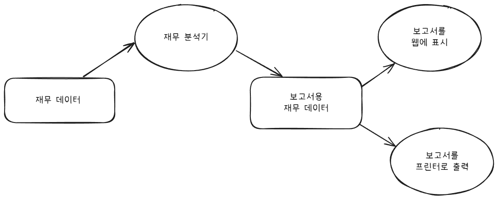
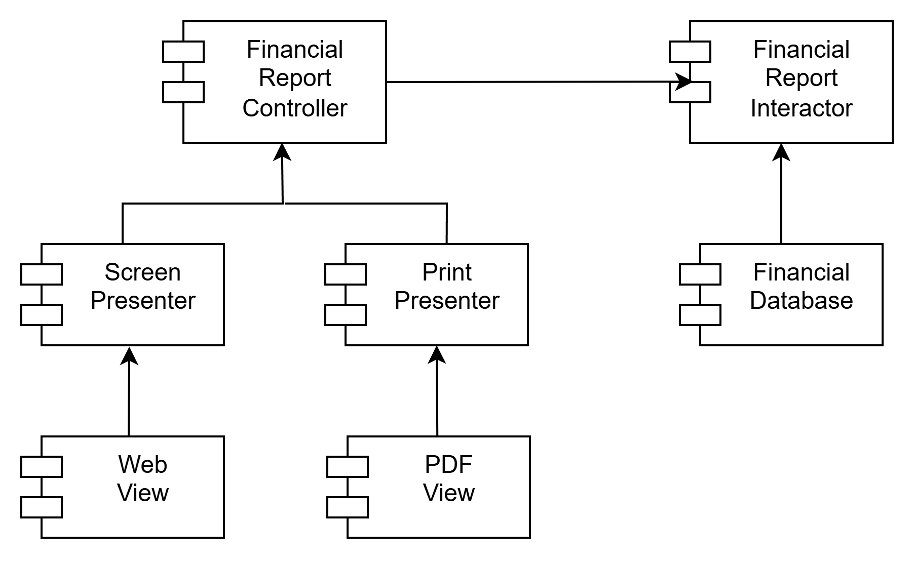

# 08장 OCP: 개방-폐쇄 원칙

OCP라는 용어는 1988년 버트란트 마이어(Bertrand Meyer)가 만들었는데, 다음과 같다.

> 소프트웨어 개체(artifact)는 확장에는 열려 있어야 하고, 변경에는 닫혀 있어야 한다.

소프트웨어 아키텍처를 공부하는 가장 근본적인 이유가 바로 이 때문이다.  
요구사항을 살짝 확장하는 데 소프트웨어를 엄청나게 수정해야 한다면, 그 소프트웨어 시스템을 설계한 아키텍트는 엄청난 실패에 맞닥뜨린 것이다.

소프트웨어 설계를 공부하기 시작한지 얼마 안된 사람들 대다수는 OCP를 클래스와 모듈을 설계할 때 도움되는 원칙이라고 알고있다.

하지만 아키텍처 컴포넌트 수준에서 OCP를 고려할 때 훨씬 중요한 의미를 가진다.

## 사고 실험

재무제표를 웹 페이지로 보여주는 시스템이 있다고 생각해보자.  
웹 페이지에 표시되는 데이터는 스크롤할 수 있으며, 음수는 빨간색으로 출력한다.

이해관계자가 동일 정보를 보고서 형태로 변환해서 흑백 프린터로 출력해달라고 요청했다고 해보자.  
보고서에는 페이지 번호가 매겨져 있어야 하고, 페이지마다 적절한 머리글과 바닥글이 있어야 하며, 표에 각 열에는 레이블이 있어야 한다. 또한 음수는 괄호로 감싸야한다.

원래 코드는 얼마나 많이 수정해야 할까?

이상적인 변경량은 0이다.  
어떻게 하면 될까? 서로 다른 목적으로 변경된느 요소를 적절하게 분리하고(SRP), 이들 요소 사이의 의존성을 체계화함으로써(DIP) 변경량을 최소화할 수 있다.

여기서 가장 중요한 것은 보고서 생성이 두 개의 책임으로 분리된다는 사실이다.  
하나는 보고서용 데이터를 계산하는 책임이며,  
하나는 이 데이터를 웹으로 보여주거나 종이로 프린트하기에 적합한 형태로 표현하는 책임이다.

이처럼 책임을 분리했다면, 두 책임 중 하나에서 변경이 발생하더라도 다른 하나는 변경되지 않도록 소스 코드 의존성도 확실해 조직화해야 한다.  
또한 새로 조직화한 구조에서는 행위가 확장될 때 변경이 발생하지 않음을 보장해야 한다.

이러한 목적을 달성하려면 처리 과정을 클래스 단위로 분할하고, 컴포넌트 단위로 구분해야 한다.  
이 그림에는 Controller, Interactor, Database, Presenter와 View 컴포넌트들이 있다.

\<I>로 표시된 클래스는 인터페이스, \<DS>로 표시된 클래스는 데이터구조다.  
열린 화살표는 사용(using) 관계, 닫힌 화살표는 구현(implement) 관계 또는 상속(ingeritance) 관계다.

여기서 주목할 건 모든 의존성이 소스 코드 의존성을 나타낸다는 것이다.  
화살표가 A 클래스에서 B 클래스로 향한다면, A 클래스에서는 B 클래스를 호출하지만, B 클래스에서는 A 클래스를 전혀 호출하지 못한다.

모든 컴포넌트 단계는 단방향이고, 화살표는 변경으로부터 보호하려는 컴포넌트를 향하도록 그려진다.

이 예제의 경우 Presenter에서 발생한 변경으로부터 Controller를 보호하고자 한다.  
그리고 View에서 발생한 변경으로부터 Presenter를 보호하고자 한다.  
Interactor는 다른 모든 곳에서 발생한 변경으로부터 보호하고자 한다.

Interactor가 왜 이처럼 특별한 위치에 있어야 하나? 그것은 Inteteractor가 업무 규칙을 포함하기 때문이다.  
Interactor는 애플리케이션에서 가장 높은 수준의 정책을 포함한다.

보호의 계층구조가 수준(level)이라는 개념을 바탕으로 어떻게 생성되는지 주목하자.

이것이 아키텍처 수준에서 OCP가 동작하는 방식이다.  
컴포넌트 계층구조를 이와 같이 조직화하면 저수준 컴포넌트에서 발생한 변경으로부터 고수준 컴포넌트를 보호할 수 있다.

## 방향성 제어

8.2의 클래스 설계를 보고 너무 놀라 뒷걸음질쳤다면 다시 한 번 잘 살펴보아라..

컴포넌트 간 의존성이 제대로 된 방향으로 향하고 있음을 보여주기 위해 일부러 다소 복잡하게 그렸다.

예를 들어 FinancialDataGateway 인터페이스는 FinancialReportGenerator와 FinancialDataMapper 사이에 있는데, 이는 의존성 역전을 위한 것이다.  
FinancialDataGateway 인터페이스가 없었다면 의존성이 Interactor 컴포넌트에서 Database 컴포넌트로 바로 향하게 된다.

그렇게 되면 도메인 로직이 DB 구현에 묶여 나중에 DB를 교체하거나 다른 저장소를 사용하게 되면 Interactor를 수정해야 함

FinancialReportPresenter 인터페이스와 View 인터페이스도 같은 역할을 한다.

## 정보 은닉

FinancialReportRequester 인터페이스는 방향성 제어와는 다른 목적을 가진다.  
이 인터페이스는 FinancialReportController가 Interactor 내부에 대해 너무 많이 알지 못하도록 막기 위해서 존재한다.

이 인터페이스가 없으면 Controller는 FinancialEntities에 대해 추이 종속성(transitive dependency)을 가지게 된다.

추이 종속성을 가지게 되면, 소프트웨어 엔티티는 '자신이 직접 사용하지 않는 요소에는 절대로 의존해서는 안된다'는 소프트웨어 원칙을 위반하게 된다.

이 원칙은 ISP: 인터페이스 분리 원칙과 CRP: 공통 재사용 원칙을 설명할 때 다시 설명하겠다.

## 결론

OCP는 시스템의 아키텍처를 떠받치는 원동력 중 하나다.

OCP의 목표는 시스템을 확장하기 쉬운 동시에 변경으로 인해 시스템이 너무 많은 영향을 받지 않도록 하는 데 있다.

시스템을 컴포넌트 단위로 분리하고, 저수준 컴포넌트에서 발생한 변경으로부터 고수준 컴포넌트를 보호할 수 있는 형태의 의존성 계층구조가 만들어지도록 해야 한다.
