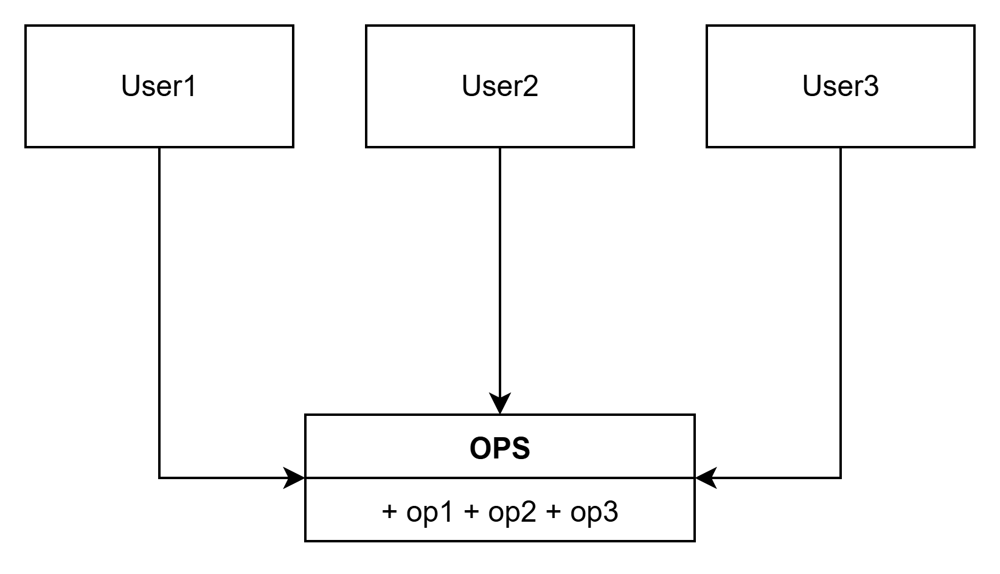
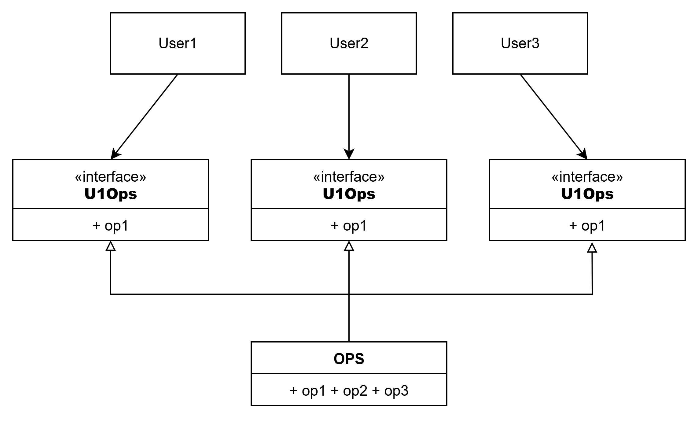

# ISP: 인터페이스 분리 원칙

인터페이스 분리 원칙은 다음 그림에서 이름이 유래했다.

다수의 사용자가 OPS 클래스의 오퍼레이션을 사용한다.  
User1은 오직 op1을, User2는 op2 만을, User3는 op3만을 사용한다고 해보자.

OPS가 정적 타입 언어로 작성된 클래스라면, User1은 op2와 op3를 전혀 사용하지 않음에도 이 두 메서드에 의존하게 된다.

이러한 의존성으로 인해 OPS 클래스에서 op2의 소스코드가 변경되면 User1도 다시 컴파일 한 후 새로 배포해야 한다.

이러한 문제는 다음처럼 오퍼레이션을 인터페이스 단위로 분리하여 해결할 수 있다.

User1의 소스코드는 U1Ops와 op1에는 의존하지만 OPS에는 의존하지 않게 된다.  
따라서 OPS에서 발생한 변경이 User1과는 전혀 관계 없는 변경이라면, User1을 다시 컴파일하고 새로 배포하는 상황은 발생하지 않는다.

## ISP와 언어

앞에서 본 사례는 언어 타입에 의존한다.  
정적 타입 언어는 사용자가 import, user 또는 include 같은 타입 선언문을 사용하도록 강제한다.

이로 인해 소스 코드 의존성이 발생하고, 재컴파일/재배포가 강제되는 상황이 초래된다.

루비나 파이썬과 같은 동적 타입 언어에서는 소스 코드에 선언문이 존재하지 않는다.  
런타임에 추론이 발생하여 의존성이 없어 재컴파일/재배포가 필요 없다.

이러한 사실로 인해 ISP를 아키텍처가 아니라, 언어와 관련된 문제라고 이야기할 여지가 있겠다.

## ISP와 아키텍처

일반적으로, 필요 이상으로 많은 걸 포함하는 모듈에 의존하는 것은 해로운 일이다.  
불필요한 재컴파일, 재배포를 강제하기 때문이다.

S 시스템에 F 라는 프레임워크를 도입하길 원한다.  
그리고 F의 개발자는 특정 데이터베이스 D를 반드시 사용하도록 만들었다고 가정해보자.

S는 F에 의존하며, F는 다시 D에 의존한다.

F에서는 불필요한 기능, S와는 전혀 관계 없는 기능이 D에 포함된다고 가정하자.  
그 기능 때문에 D 내부가 변경되면, F를 재배포해야 할 수도 있고, S까지 재배포해야 할지 모른다.

## 결론

불필요한 짐을 실은 무언가에 의존하면 예상치도 못한 문제에 빠진다는 사실이다.
