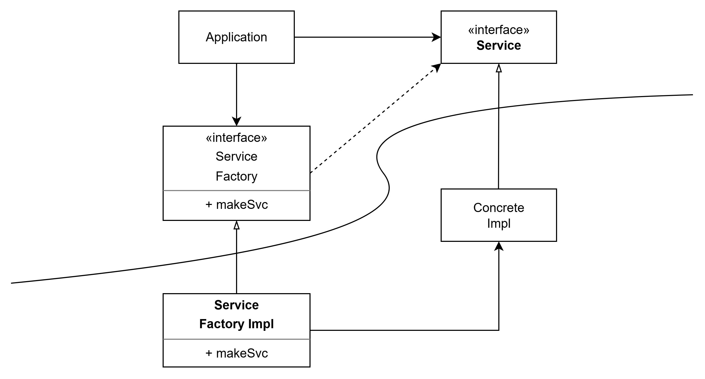

# 11장 DIP: 의존성 역전 원칙

의존성 역전 원칙에서 말하는 '유연성이 극대화된 시스템'이란 소스 코드 의존성이 추상(abstraction)에 의존하며, 구체(concrete)에는 의존하지 않는 시스템이다.

자바 같은 정적 타입 언어에서 이 말은 use, import, include 구문은 오직 인터페이스나 추상 클래스 같은 추상적인 선언만을 참조해야 한다는 뜻이다.

동적 타입 언어에도 동일한 규칙이 적용된다.

이 아이디어를 규칙으로 보기는 확실히 비현실적이다.  
자바의 String은 구체 클래스이며, 이를 굳이 추상 클래스로 만들려는 시도는 현실성이 없다.

프로그래머와 아키텍트는 String 클래스에서 변덕스러운 변경이 자주 발생하리라고 염려할 필요가 없으므로 DIP를 논할 때 운영체제나 플랫폼 같이 안정성이 보장된 환경에 대해서는 무시하는 편이다.

우리가 의존하지 않도록 피하고자 하는 것은 바로 변동성이 큰(volatile) 구체적인 요소다.

## 안정된 추상화

인터페이스는 구현체보다 변동성이 낮다.  
실제로 뛰어난 아키텍트는 인터페이스의 변동성을 낮추기 위해 애쓴다.  
인터페이스를 변경하지 않고도 구현체에 기능을 추가할 수 있는 방법을 찾기 위해 노력한다.

DIP 에서 전달하려는 내용은 다음과 같은 실천법으로 요약 가능하다.

- 변동성이 큰 구체 클래스를 참조하지 말라.

  대신 추상 인터페이스를 참조하고, 객체 생성 방식은 추상 팩토리(Abstract Factory)를 사용한다.

- 변동성이 큰 구체 클래스로부터 파생하지 말라.

  상속은 소스 코드에 존재하는 모든 관계 중에 가장 강력한 동시에 뻣뻣하다.  
   상속은 신중히 사용해야 한다.

- 구체 함수를 오버라이드 하지 말라.

  대체로 구체 함수는 소스 코드 의존성을 필요로 한다.  
   구체 함수를 오버라이드하면 의존성을 제거할 수 없게되며, 의존성을 상속하게 된다.

  차라리 추상 함수로 선언하고, 구현체에서 용도에 맞게 따로 구현하는게 좋다.

## 팩토리

변동성이 큰 구체적인 객체는 특별히 주의해서 생성해야 한다.

대다수의 객체 지향 언어에서 이를 위해 추상 팩토리를 사용하곤 한다.

Application은 Service 인터페이스를 통해 ConcreteImpl을 사용해야하는데, 소스 코드 의존성을 만들지 않기 위해 Application은 ServiceFactory 인터페이스의 makeSvc 메서드를 호출한다.  
ServiceFactoryImpl이 ConcreteImpl의 인스턴스를 생성한 후 Service 타입으로 반환한다.

그림 11-1의 곡선은 아키텍처 경계를 뜻한다.  
추상 컴포넌트는 애플리케이션의 모든 고수준 업무 규칙을 포함한다.  
구체 컴포넌트는 업무 규칙을 다루기 위해 필요한 모든 세부 사항을 포함한다.

제어흐름은 소스 코드 의존성과 정반대 방향으로 곡선을 가로지른다는 점을 주목하자.  
이러한 이유로 이 원칙을 의존성 역전(Dependency Inversion)이라고 부른다.

## 구체 컴포넌트

그림 11-1의 구체 컴포넌트에는 구체적인 의존성이 하나 있다.(ServiceFactoryImpl 구체 클래스가 ConcreteImpl 구체 클래스에 의존)

DIP에 위배된다. 하지만 이는 일반적인 일이다.  
모든 DIP 위배를 없앨 수는 없다.

다만 DIP를 위배하는 클래스들은 적은 수의 구체 컴포넌트 내부로 모을 수 있고, 이를 통해 시스템의 나머지 부분과는 분리할 수 있다.

## 결론

DIP는 아키텍처 다이어그램에서 가장 눈에 드러나는 원칙이 될 것이다.  
그림 11-1의 곡선은 이후의 장에서는 아키텍처 경계가 될 것이다.  
의존성은 이 곡선을 경계로 더 추상적인 엔티티가 있는 쪽으로만 향한다.
