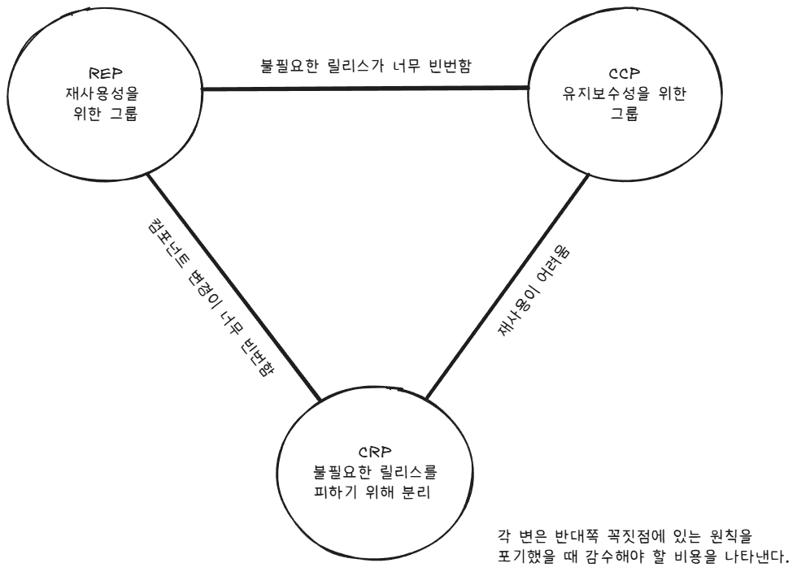

# 13장 컴포넌트 응집도

어떤 클래스를 어느 컴포넌트에 포함시켜야 할까?

컴포넌트 응집도와 관련된 세 가지 원칙  
* REP: 재사용/릴리스 등가 원칙(Reuse/Release Equivalence Principle)
* CCP: 공통 폐쇄 원칙(Common Closure Principle)
* CRP: 공통 재사용 원칙(Common Reuse Principle)

## REP: 재사용/릴리스 등가 원칙

소프트웨어 컴포넌트가 릴리스 절차를 통해 추적 관리되지 않거나 릴리스 번호가 부여되지 않는다면 해당 컴포넌트를 재사용하고 싶어도 할 수 없다.

릴리스 절차에는 적절한 공지와 함께 릴리스 문서 작성도 포함되어야 한다.

소프트웨어 설계와 아키텍처 관점에서 보면 단일 컴포넌트는 응집성 높은 클래스와 모듈들로 구성되어야 한다.  
컴포넌트를 구성하는 모든 모듈을 서로 공유하는 중요한 테마나 목적이 있어야 한다.

하나의 컴포넌트로 묶인 클래스와 모듈은 버전 번호가 같아야 하며, 동일한 릴리스로 추적 관리되고, 동일한 릴리스 문서에 포함되어야 한다.

## CCP: 공통 폐쇄 원칙

> 동일한 이유로 동일한 시점에 변경되는 클래스를 같은 컴포넌트로 묶어라.

이 원칙은 단일 책임 원칙을 컴포넌트 관점에서 다시 쓴 것이다.

공통 폐쇄 원칙에서도 마찬가지로 단일 컴포넌트는 변경의 이유가 여러 개 있어서는 안 된다고 말한다.

애플리케이션에서 코드가 반드시 변경되어야 한다면, 변경이 여러 컴포넌트에서 분산되어 발생하기보다는 변경 모두가 단일 컴포넌트에서 발생하는 편이 낫다.

따라서 같은 이유로 변경될 가능성이 있는 클래스는 모두 한곳으로 묶을 것을 권한다.

이를 통해 소프트웨어를 릴리스, 재검증, 배포하는 일과 관련된 작업량을 최소화할 수 있다.

## CRP: 공통 재사용 원칙

> 컴포넌트 사용자들을 필요하지 않는 것에 의존하게 강요하지 말라.

CRP는 함께 재사용되는 경향이 있는 클래스와 모듈은 같은 컴포넌트에 포함해야 하지만,
동시에 함께 재사용되지 않는 클래스들은 절대 같은 컴포넌트에 포함해서는 안 된다고 말한다.

예를 들어, 컨테이너 클래스와 해당 클래스의 이터레이터는 서로 강하게 결합되어 함께 사용되므로 동일한 컴포넌트에 위치해야 한다.

반면, 서로 독립적으로 사용될 수 있는 클래스들을 같은 컴포넌트에 묶어두면
그 중 하나만 필요하더라도 전체 컴포넌트에 의존해야 하므로,
사용자는 불필요한 의존성과 변경 전파를 떠안게 된다.

컴포넌트 간 의존성은 개별 클래스 수준이 아니라 컴포넌트 전체 수준의 의존성임을 확실히 인지해야 한다.

그렇기 때문에 CRP는 어떤 클래스를 묶어도 되는지보다, 어떤 클래스를 묶어서는 안 되는지를 더 강조한다.  
함께 재사용되지 않는 클래스를 한 컴포넌트에 묶으면, 그 컴포넌트 전체를 가져다 써야 하기 때문에 사용자에게 불필요한 의존성을 강요하게 된다.

## 컴포넌트 응집도에 대한 균형 다이어그램

응집도에 관한 세 원칙이 서로 상충된다는 사실을 눈치챘을 수도 있다.

그 이유는 CCP의 응집 단위(변경 중심)와 CRP의 응집 단위(재사용 중심)가 항상 일치하지 않기 때문이다.

예를 들어 Controller-Service-Repository 구조에서

```
UserController
UserService
UserRepository
OrderRepository
OrderService
```

### CCP 관점:  
사용자 기능을 수정하면 Controller, Service, Repository가 같이 바뀌므로  
한 컴포넌트로 묶자  
->
```
user-component/
 ├─ UserController
 ├─ UserService
 └─ UserRepository
```

### CRP 관점:
Repository는 다른 서비스에서도 재사용된다.  
OrderService에서도 UserRepository를 사용할 수있다.  
UserRepository를 UserComponent에 묶으면 OrderService가 UserComponent 전체에 의존해야 한다.

->
```
user-component/
 ├─ UserController
 └─ UserService
persistence-component/
 └─ UserRepository
```



오로지 REP와 CRP에만 중점을 두면, 사소한 변경이 생겼을 때 너무 많은 컴포넌트에 영향을 미친다.  
반대로 CCP와 REP에만 과도하게 집중하면 불필요한 릴리스가 너무 빈번해진다.

따라서 아키텍트는 개발팀이 현재 관심을 기울이는 부분을 파악해야 하며, 시간이 흐르면서 관심사가 변한다는 사실도 이해하고 있어야 한다.

## 결론

과거에는 결함도의 대한 인식 수준이 훨씬 단순했다.  
하지만 이 세 가지 원칙은 응집도가 가질 수 있는 훨씬 복잡한 다양성을 설명해준다.

어느 클래스들을 묶어서 컴포넌트로 만들지 결정할 때, 재사용성과 개발 가능성이라는 상충하는 힘을 반드시 고려해야한다.

이 균형점은 유동적이며, 프로젝트 진행에 따라 변한다.