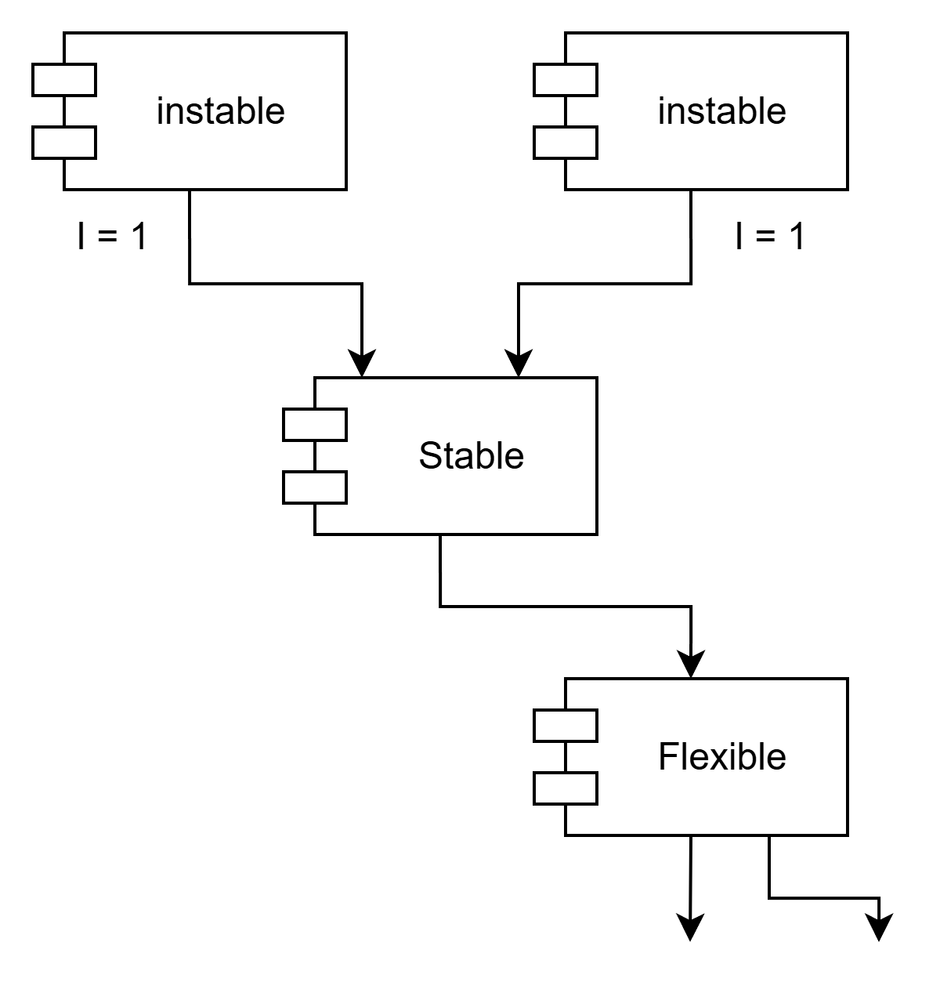

# 14장 컴포넌트 결합

이 장에서 다루는 세 가지 원칙은 컴포넌트 사이의 관계를 설명한다.

## ADP: 의존성 비순환 원칙

> 컴포넌트 의존성 그래프에 순환이 있어서는 안 된다.

내가 의존하고 있던 무언가를 다른 개발자가 수정하여 내 코드가 작동하지 않게 되는 경험을 해본 적이 있지 않은가?

이러한 현상은 많은 개발자가 동일한 소스 파일을 수정하는 환경에서 발생한다.

빌드는커녕 개발팀 모두가 누군가가 마지막으로 수정한 코드 때문에 망가진 부분이 동작하도록 만들기 위해 코드를 수정하고 또 수정하는 작업만이 계속될 뿐이다.

이 문제의 해결책으로 두 가지 방법이 발전되어 왔는데, 다음과 같다.  
1. 주 단위 빌드
2. 의존성 비순환 원칙

### 주 단위 빌드

먼저 개발자는 일주일의 첫 4일은 서로를 신경쓰지 않는다.  
코드를 개인적으로 복사하여 작업하다가, 금요일에 변경된 코드를 모두 통합하여 시스템을 빌드한다.

4일 동안은 자유롭겠지만, 금요일에 통합과 관련된 막대한 업보를 치뤄야하고, 프로젝트가 커지면 통합은 하루 만에 끝마치기 어려워진다.

통합을 시작하는 날을 앞당겨도, 빌드 주기를 격주로 변경해도 잠깐은 만족스럽겠지만, 프로젝트 규모가 커지면서 통합에 드는 시간은 계속해서 늘어난다.

### 순환 의존성 제거하기

이 문제의 해결책은 개발 환경을 릴리스 가능한 컴포넌트 단위로 분리하는 것이다.

컴포넌트는 개별 개발자 또는 단일 개발팀이 책임질 수 있는 작업 단위가 된다.  
개발자가 해당 컴포넌트를 동작하도록 만든 후, 해당 컴포넌트를 릴리스하여 다른 개발자가 사용할 수 있도록 만든다.

다른 팀에서는 새 릴리스를 당장 적용할지 선택할 수 있다. 적용하지 않기로 했다면 그냥 과거 버전의 릴리스를 계속 사용한다.

통합은 작고 점진적으로 이뤄진다.  
특정 시점에 모든 개발자가 한데 모여서 진행 중인 작업을 모두 통합하는 일은 사라진다.

이 절차가 성공적으로 동작하려면 컴포넌트 사이의 의존성 구조를 반드시 관리해야 한다.  
순환이 있어서는 안된다.

즉, 컴포넌트간 의존성이 비순환 방향 그래프여야 한다는 것이다.

Presenters를 담당하는 팀에서 이 컴포넌트의 새로운 릴리스를 만들면, View와 Main 컴포넌트가 영향을 받는다(의존성 화살표를 거꾸로 따라가면 된다).

이 두 컴포넌트를 작업 중인 개발자라면, Presenters의 새로운 릴리스와 자신의 작업물을 언제 통합할지 결정해야 한다.

#### 순환이 컴포넌트 의존성 그래프에 미치는 영향

새 요구사항으로 인해 Entities에 포함된 클래스 하나가 Authorizer에 포함된 클래스 하나를 사용하도록 변경할 수 밖에 없다고 가정해보자.

이렇게 되면 순환 의존성이 발생한다.

Entities, Authorizer, Interactors는 사실상 하나의 거대한 컴포넌트가 되어 버린다.

결국 해당 컴포넌트의 개발자들은 모두 서로에게 얽매이게 되는데, 모두 항상 정확하게 동일한 릴리스를 사용해야 하기 때문이다.

이처럼 순환이 생기면 컴포넌트를 분리하기가 상당히 어려워지고, 단위 테스트, 릴리스도 굉장히 어려워진다.

#### 순환 끊기

1. 의존성 역전 원칙을 이용한다.

    Entities 내 Authorizer에 의존하는 클래스(User 라고 하자)가 필요로 하는 메서드를 제공하는 인터페이스를 생성한다.

    이 인터페이스를 Entities에 위치시키고, Authorizer에서는 이 인터페이스를 상속받는다.

    이렇게 하면 Entities와 Authorizer 사이의 의존성을 역전시킬 수 있고, 순환을 끊을 수 있다.

    

2. Entities와 Authorizer가 모두 의존하는 새로운 컴포넌트를 만든다.  
그리고 두 컴포넌트가 모두 의존하는 클래스들을 새로운 컴포넌트로 이동시킨다.

    

#### 흐트러짐(Jitters)

두 번째 해결책에서 시사하는 바는 요구사항이 변경되면 컴포넌트 구조도 변경될 수 있다는 사실이다.

따라서 의존성 구조에 순환이 발생하는지를 항상 관찰해야 한다.

## 하향식(top-down) 설계

컴포넌트 구조는 하향식으로 설계될 수 없다.  
컴포넌트는 시스템에서 가장 먼저 설계할 수 있는 대상이 아니며, 오히려 시스템이 성장하고 변경될 때 함께 진화한다.

우리는 보통 시스템을 설게한다고 하면  
큰 기능 -> 하위 기능 -> 클래스  
처럼 큰 덩어리에서 점점 쪼개 내려가는 구조를 떠올린다.

하지만 컴포넌트는 시스템이 완성된 후에 '발견되는 것'이지, 시스템을 설계할 때 미리 '결정되는 것'이 아니다.

컴포넌트 의존성 다이어그램은 애플리케이션의 빌드 가능성과 유지보수성을 보여주는 지도와 같다. 애플리케이션의 기능을 기술하는 것과는 상관이 없다.

그렇기 때문에 컴포넌트 구조는 프로젝트 초기에 설계할 수 없다.  
빌드하거나 유지보수할 소프트웨어가 없다면 빌드와 유지보수에 관한 지도 또한 필요 없기 때문이다.

## SDP: 안정된 의존성 원칙

> 안정성의 방향으로(더 안정된 쪽에) 의존하라.

변경이 쉽지 않은 컴포넌트가 변동이 예상되는 컴포넌트에 의존하게 만들어서는 절대로 안 된다.

한번 의존하게 되면 변동성이 큰 컴포넌트도 결국 변경이 어려워진다.

당신이 모듈을 만들 때는 변경하기 쉽도록 설계했지만, 이 모듈에 누군가가 의존성을 매달아 버리면 당신의 모듈도 변경하기 어려워진다.

안정된 의존성 원칙을 준수하면 변경하기 어려운 모듈이 변경하기 쉽게 만들어진 모듈에 의존하지 않도록 만들 수 있다.

### 안정성

안정성(stability)은 무슨 뜻인가?

동전을 옆으로 세우면 안정적이라고 할 수 있는가? 아니다.  
동전을 건드리지 않는다면 이 상태를 오래 유지할 수 있겠지만 그래도 안정적이지 않다.

이처럼 안정성은 변화가 발생하는 빈도와는 관련이 없다.

안정성은 변경을 만들기 위해 필요한 작업량과 관련된다.

소프트웨어를 안정적으로 만드는 방법, 변경하기 어렵게 만드는 확실한 방법 중 하나는 다른 컴포넌트들이 해당 컴포넌트에 의존하도록 만드는 것이다.

컴포넌트 안쪽으로 들어오는 의존성이 많아지면 상당히 안정적이라고 볼 수 있는데, 사소한 변경이라도 의존하는 모든 컴포넌트를 만족시키면서 변경하려면 상당한 노력이 들기 때문이다.

X는 안정된 컴포넌트다. 세 컴포넌트가 X에 의존하며, X 컴포넌트는 변경하지 말아야 할 이유가 세 가지나 되기 때문이다.

이 경우 X는 세 컴포넌트를 '책임진다'라고 말한다.  

반대로 X는 어디에도 의존하지 않으므로 X가 변경되도록 만들 수 있는 외적인 영향이 전혀 없다.

이 경우 X는 '독립적이다'라고 말한다.

Y는 상당히 불안정한 컴포넌트다.  
어떤 컴포넌트도 Y에 의존하지 않으므로 Y는 책임성이 없다.

또한 Y는 세 개의 컴포넌트에 의존하므로 변경이 발생할 수 있는 외부 요인이 세 가지다.  
이 경우 Y는 의존적이라고 말한다.

### 안정성 지표

* $F_i$, Fan-in: 안으로 들어오는 의존성. 컴포넌트 내부의 클래스에 의존하는 컴포넌트 외부의 클래스 개수를 나타낸다.

* $F_o$, Fan-out: 바깥으로 나가는 의존성. 이 지표는 컴포넌트 외부의 클래스에 의존하는 컴포넌트 내부의 클래스 개수를 나타낸다.

* $I$(불안정성): $I = F_o/(F_i+F_o)$

    $I=0$ 이면 최고로 안정된 컴포넌트라는 뜻이다.  
    $I=1$ 이면 최고로 불안정한 컴포넌트라는 뜻이다.

SDP에서 컴포넌트의 I 지표는 그 컴포넌트가 의존하는 다른 컴포넌트들의 I 보다 커야 한다고 말한다.  
즉, 의존성 방향으로 갈수록 I 지표 값이 감소해야 한다.

### 모든 컴포넌트가 안정적이어야 하는 것은 아니다.

모든 컴포넌트가 최고로 안정적인 시스템이라면 변경이 불가능하다.  
우리가 컴포넌트 구조를 설계할 때 기대하는 것은 불안정한 컴포넌트도 있고 안정된 컴포넌트도 존재하는 상태다.

그림 14-9는 SDP가 어떻게 위배될 수 있는지를 보여준다.

Flexible은 변경하기 쉽도록 설계되었다. 우리는 Flexible이 불안정한 상태이기를 바란다.

하지만 Stable 컴포넌트에서 작업하던 개발자가 Flexible에 의존성을 걸게 되었다.  
이로 인해 SDP를 위배하는데, Stable의 I 값이 Flexible의 I 보다 작기 때문이다.  
결국 Flexible은 변경하기 어렵게 되었고, Flexible을 변경하게 되면 Stable과 Stable에 의존하는 컴포넌트들도 어떤 조치를 취해야 한다.

DIP를 적용하면 이 문제를 해결할 수 있다.

US 인터페이스를 생성한 후 UServer 컴포넌트에 넣는다.  
US 인터페이스에는 U가 사용하는 모든 메서드가 반드시 선언되어 있어야 한다.

C가 해당 인터페이스를 구현하도록 만든다.

이를 통해 Stable의 Flexible에 대한 의존성을 끊을 수 있고, 두 컴포넌트는 UServer에 의존한다.

UServer는 매우 안정된 상태($I=0$)이며, Flexible은 자신에게 맞는 불안정성($I=1$)을 그대로 유지할 수 있다.

## SAP: 안정된 추상화 원칙

> 컴포넌트는 안정된 정도만큼만 추상화되어야 한다.

시스템에는 자주 변경해서는 안되는 소프트웨어도 있다.  
ex. 고수준 아키텍처나 정책 결정과 관련된 소프트웨어

따라서 시스템에서 고수준 정책을 캡슐화하는 소프트웨어는 반드시 안정된 컴포넌트($I=0$)에 위치해야 한다.

하지만 고수준 정책을 안정된 컴포넌트에 위치시키면, 그 정책을 포함하는 소스 코드는 수정하기가 어려워진다. 이로 인해 시스템 전체 아키텍처가 유연성을 잃는다.

컴포넌트가 최고로 안정된 상태이면서도($I=0$) 변경에 충분히 대응할 수 있도록 유연하게 만들 수 있을까?

OCP를 이용하면 된다.

OCP는 클래스를 수정하지 않고도 확장 가능한 구조를 만드는 것이 바람직하다고 말한다.  
이 원칙을 가장 잘 구현하는 예가 바로 추상 클래스다.

### 안정된 추상화 원칙

SAP(Stable Abstractions Principle)은 안정성과 추상화 정도 사이의 관계를 정의한다.

SAP는 안정된 컴포넌트는 추상 컴포넌트여야 하며, 이를 통해 안정성이 컴포넌트를 확장하는 일을 방해해서는 안 된다고 말한다.

반대로 불안정한 컴포넌트는 반드시 구체 컴포넌트여야 한다고 말한다.

안정적인 컴포넌트라면 반드시 인터페이스와 추상 클래스로 구성되어 쉽게 확장할 수 있어야 한다.  
안정된 컴포넌트가 확장이 가능해지면 유연성을 얻게 되고 아키텍처를 과도하게 제약하지 않게 된다.

SAP와 SDP를 결합하면 컴포넌트에 대한 DIP나 마찬가지가 된다.  
SDP(안정된 의존성 원칙)는 의존성이 반드시 안정성의 방향으로 향해야 한다고 말하며,  
SAP(안정된 추상화 원칙)는 안정성이 결국 추상화를 의미한다고 말하기 때문이다.

따라서 의존성은 추상화의 방향으로 향하게 된다.

### 추상화 정도 측정하기

$A$ 지표는 컴포넌트의 추상화 정도를 측정한 값이다.  
컴포넌트의 클래스 총 수 대비 인터페이스와 추상 클래스의 개수를 계산한 값이다.

$N_c$: 컴포넌트의 클래스 개수  
$N_a$: 컴포넌트의 추상 클래스와 인터페이스의 개수  
$A$: 추상화 정도. $A = N_a / N_c$

$A$ 가 0이면 컴포넌트에는 추상 클래스가 하나도 없다는 뜻이다. 1이면 오로지 추상 클래스만을 포함한다는 뜻이다.

### 주계열

안정성($I$)과 추상화 정도($A$) 사이의 관계를 정의해야한다.  
수직축에는 $A$를, 수평 축에는 $I$를 나타내는 그래프를 그린다.

최고로 안정적이며 추상화된 컴포넌트는 좌측 상단인 (0, 1)에 위치하는 것을 확인할 수 있다.  
최고로 불안정하며 구체화된 컴포넌트는 우측 하단인 (1, 0)에 위치한다.

모든 컴포넌트가 (0, 1), (1, 0)에 위치한 것은 아니므로 $A/I$ 그래프 상에서 컴포넌트가 위치할 수 있는 합리적인 지점을 정의하는 점의 궤적이 있으리라고 가정해볼 수 있다.

이 궤적은 컴포넌트가 절대로 위치해서는 안 되는 영역, 배제할 구역(Zone of Exclusion)을 찾는 방식으로 추론할 수 있다.

### 고통의 구역

(0, 0) 주변에 위치한 컴포넌트들은 매우 안정적이며 구체적이다.

하지만 바람직하지 않은데, 뻣뻣한 상태이기 때문이다.  
추상적이지 않으므로 확장할 수도 없고, 안정적이므로 변경하기 상당히 어렵다.

데이터베이스 스키마가 한 예이다.  
스키마는 변동성이 높은데, 극단적으로 구체적이며 많은 컴포넌트가 여기에 의존한다..  
스키마가 변경되면 대체로 고통을 수반한다.

구체적인 유틸리티 라이브러리도 이 구역에 속한다.  
String 라이브러리를 생각해보자.  
이 컴포넌트에 속한 클래스는 모두 구체 클래스다.  
하지만 이 컴포넌트는 굉장히 광범위하게 사용되기 때문에 이 컴포넌트를 수정해버리면 혼란을 초래할 수 있다.

하지만 String은 변동성이 없기 때문에 해롭지 않다.  
고통의 구역에서 문제가 되는 경우는 변동성이 있는 소프트웨어 컴포넌트다.

### 쓸모없는 구역

(1, 1) 주변 컴포넌트를 생각해보자.

이 영역도 바람직하지 않은데, 최고로 추상적이지만, 누구도 그 컴포넌트에 의존하지 않기 때문이다.  
이러한 컴포넌트는 쓸모가 없다.

### 배제 구역 벗어나기

변동성이 큰 컴포넌트 대부분은 두 배제 구역으로부터 가능한 한 멀리 떨어뜨려야 한다.

각 배제 구역으로부터 최대한 멀리 떨어진 점의 궤적은 (1, 0)과 (0, 1)을 잇는 선분이다.  
이 선분을 주계열(Main Sequence)라고 부르겠다.

주계열에 위치한 컴포넌트는 자신의 안정성에 비해 너무 추상적이지도 않고, 추상화 정도에 비해 너무 불안정하지도 않다.

### 주계열과의 거리

이상적인 상태로부터 컴포넌트가 얼마나 멀리 떨어져 있는지 측정하는 지표를 만들어볼 수 있다.

* $D$: 거리. $D = |A + I - 1|$ ([0, 1])  
$D$가 0이면 컴포넌트가 주계열 바로 위에 위치, 1이면 주계열로부터 가장 멀리 위치한다는 뜻이다.

설계를 통계적으로 분석하는 일 또한 가능하다.  
설계에 포함된 모든 컴포넌트에 대해 $D$ 지표의 평균과 분산을 구할 수 있다.

각 컴포넌트의 $D$ 값을 시간에 따라 그려볼 수도 있다.  
특정 시점에 어떤 컴포넌트의 $D$ 값이 관리 한계를 초과한다면 원인을 시간을 들여 조사해 볼 가치가 있을 것이다.

## 결론

의존성 관리 지표는 설계의 의존성과 추상화 정도가 내가 '훌륭한' 패턴이라고 생각하는 수준에 얼마나 잘 부합하는지를 측정한다.

하지만 지표는 신이 아니다..