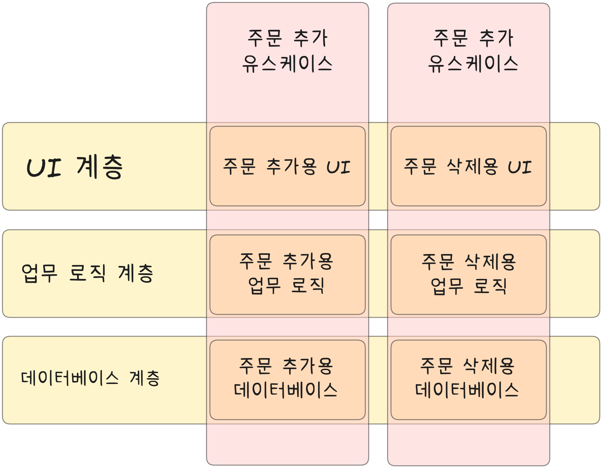

# 16장 독립성

앞서 말했듯, 좋은 아키텍처는 다음은 지원해야 한다.
* 시스템의 유스케이스
* 시스템의 운영
* 시스템의 개발
* 시스템의 배포

## 유스케이스

시스템의 아키텍처는 시스템의 의도를 지원해야 한다는 뜻이다.

실제로 아키텍트의 최우선 관심사는 유스케이스이며, 아키텍처에서도 유스케이스가 최우선이다.

하지만 아키텍처는 시스템의 행위에 대해 큰 영향을 주지 않는다.  
좋은 아키텍처가 행위를 지원하기 위해 할 수 있는 일 중 가장 중요한 사항은 행위를 명확히 하고 외부로 드러내며, 시스템이 지닌 의도를 아키텍처 수준에서 알아볼 수 있게 만드는 것이다.

해당 시스템의 유스케이스는 시스템 구조 자체에서 한눈에 드러나야하며, 이것은 일급 요소로 시스템의 최상위 수준에서 알아볼 수 있으므로, 개발자가 일일이 찾아 헤매지 않아도 된다.

## 운영

시스템의 운영 지원 관점에서 아키텍처는 더 실질적이며 덜 피상적인 역할을 맡는다.

예를 들어 시스템이 초당 10만명의 고객을 처리해야 한다면, 아키텍처는 이 요구와 관련된 유스케이스에 알맞은 처리량과 응답시간을 보장해야 한다.  
만약 시스템이 수 밀리초 안에 빅데이터 테이블에 질의해야 한다면, 반드시 이러한 운영 작업을 허용할 수 있는 형태로 아키텍처를 구조화해야 한다.

이러한 형태를 지원한다는 말은 시스템에 따라 다른 의미를 지닌다.  
어떤 시스템은 MSA 형태여야 하고, 어떤 시스템은 단순한 모노리틱 프로그램 정도로 살아남기도 한다.

아키텍처에서 각 컴포넌트를 적절히 격리하여 유지하고 컴포넌트 간 통신 방식을 특정 형태로 제한하지 않는다면, 시간이 지나 운영에 필요한 요구사항이 바뀌더라도 기술 스펙트럼 사이를 전환하는 일이 훨씬 쉬워질 것이다.

## 개발

아키텍처는 개발환경을 지원하는 데 있어 핵심적인 역할을 수행한다.

콘웨이의 법칙
> 시스템을 설계하는 조직이라면 어디든지 그 조직의 의사소통 구조와 동일한 구조의 설계를 만들어 낼 것이다.

많은 팀으로 구성되며 관심사가 다양한 조직에서 어떤 시스템을 개발한다면, 각 팀이 독립적으로 행동하기 편한 아키텍처를 반드시 확보하여, 서로를 방해하지 않도록 해야 한다.

## 배포

아키텍처는 배포 용이성을 결정하는 데 중요한 역할을 한다.

이때 목표는 즉각적인 배포(immediate deployment)다.  
그렇게 하려면 시스템을 컴포넌트 단위로 적절하게 분할하고 격리시켜야 한다.

## 선택사항 열어놓기

좋은 아키텍처는 컴포넌트 구조와 관련된 이 관심사들(유스케이스, 운영, 개발, 배포) 사이에서 균형을 맞추고 각 관심사를 모두 만족시킨다.

현실에서는 이러한 균형을 잡기가 매우 어렵다...

시스템이 생명주기의 단계를 거쳐감에 따라 제약사항, 팀 구조, 배포 요구사항, 심지어 유스케이스도 변해간다.

몇몇 아키텍처 원칙은 구현하는 비용이 비교적 비싸지 않으며, 관심사들 사이에서 균형을 잡는 데 도움이 된다.  
이 원칙들은 시스템을 컴포넌트 단위로 분할할 때 도움이 되며, 선택사항을 많이, 오랫동안 열어둘 수 있게 해준다.

## 계층 결합 분리

아키텍트는 단일 책임 원칙과 공통 폐쇄 원칙을 적용하여, 맥락에 따라 서로 다른 이유로 변경되는 것들은 분리하고, 동일한 이유로 변경되는 것들은 묶는다.

사용자 인터페이스가 변경되는 이유는 업무 규칙과는 아무런 관련이 없다.  
만약 유스케이스가 두 가지 요소를 모두 포함한다면 아키텍트는 유스케이스에서 UI부분과 업무 규칙 부분을 서로 분리하고자 할 것이다.

또 다른 예로 입력 필드 유효성 검사는 애플리케이션 자체와 밀접하게 관련된 업무 규칙이다. 반대로 계좌의 이자 계산이나 재고품 집계는 업무 도메인에 더 밀접하게 연관된 업무 규칙이다.

이 두 유형의 규칙은 갖가 다른 속도로, 다른 이유로 변경될 것이다.  
따라서 이들 규칙은 서로 분리하고, 독립적으로 변경할 수 있도록 만들어야만 한다.

이제 우리는 시스템을 서로 결합되지 않은 수평적인 계층으로 분리하는 방법을 알게 되었다.  
계층의 예로는 UI, 애플리케이션에 특화된 업무 규칙, 애플리케이션과는 독립적인 업무 규칙, 데이터베이스 등을 들 수 있다.

## 유스케이스 결합 분리

서로 다른 이유로 변경되는 것에는 또 뭐가 있을까? 유스케이스 그 자체가 있다!!!

주문 입력 시스템에서 주문을 추가하는 유스케이스는 주문을 삭제하는 유스케이스와는 틀림없이 다른 속도, 다른 이유로 변경된다.

유스케이스는 시스템의 수평적인 계층을 가로지르도록 자른, 수직으로 좁다란 조각이기도 하다. 각 유스케이스는 UI의 일부, 애플리케이션 특화 업무 규칙의 일부, 애플리케이션 독립적 업무 규칙의 일부, 데이터베이스 기능의 일부를 사용한다.

따라서 우리는 시스템을 수평적 계층으로 분할하면서 동시에 해당 계층을 가로지르는, 얇은 수직적인 유스케이스로 시스템을 분할할 수 있다.

시스템에서 서로 다른 이유로 변경되는 요소들의 결합을 분리하면 기존 요소에 지장을 주지 않고도 새로운 유스케이스를 계속해서 추가할 수 있게 된다.  

## 결합 분리 모드

유스케이스에서 서로 다른 관점이 분리되었다면, 높은 처리량을 보장해야 하는 유스케이스와 낮은 처리량으로도 충분한 유스케이스는 이미 분리되어 있을 가능성이 높다.

또, UI와 데이터베이스가 업무 규칙과 분리되어 있다면, UI와 데이터베이스는 업무 규칙과는 다른 서버에서 실행될 수 있고, 높은 대역폭을 요구하는 유스케이스는 여러 서버로 복제하여 실행할 수 있다.

간단히 말해, 유스케이스 결합 분리는 운영에도 도움이 된다.

분리된 컴포넌트를 서로 다른 서버에서 실행해야 하는 상황이라면, 이들 컴포넌트가 단일 프로세서의 동일한 주소 공간에 함께 상주하는 형태로 만들어져서는 안된다.  
분리된 컴포넌트는 반드시 독립된 서비스가 되어야 하고, 일종의 네트워크를 통해 서로 통신해야 한다.

많은 아키텍트가 이러한 컴포넌트를 서비스 또는 마이크로서비스라고 한다.  
서비스에 기반한 아키텍처를 흔히 서비스 지향 아키텍처(service-oriented architecture)라고 부른다.

## 개발 독립성

컴포넌트가 완전히 분리되면 팀 사이의 간섭은 줄어든다.

## 배포 독립성

유스케이스와 계층의 결합이 분리되면 배포 측면에서도 고도의 유연성이 생긴다.

제대로 분리했다면 운영 중인 시스템에서도 계층과 유스케이스를 교체도 가능해진다.

## 중복

아키텍트는 종종 중복에 대한 공포로 인해 함정에 빠지곤 한다.

하지만 중복에도 여러 종류가 있다.

1. 진짜 중복

    한 인스턴스가 변경되면, 동일한 변경을 그 인스턴스의 모든 복사본에 반드시 적용해야 하는 경우

2. 거짓된 또는 우발적인 중복

    중복으로 보이는 두 코드 영역이 각자의 결오로 발전한다면, 이 두 코드는 진짜 중복이 아니다.

예를 들어 두 유스케이스의 화면 구조가 매우 비슷하다고 해보자.  
이 구조에 사용할 코드를 통합하고 싶은 유혹을 느낄 것이다.

하지만 이런 경우 우발적 중복일 가능성이 높다.  
시간이 지나면서 두 화면은 다른 방향으로 분기하며, 다른 모습을 갖게 된다.

해당 코드를 통합하면 나중에 다시 분리하느라 큰 수고를 감수해야 한다.

중복이 진짜 중복인지 확인하라.

## 결합 분리 모드

계층과 유스케이스의 결합을 분리하는 방법은 다양하다.

* 소스 수준 분리:

    모든 컴포넌트가 같은 주소 공간에서 실행되고, 서로 통신할 때는 간단한 함수 호출을 사용한다. (모놀리틱)

* 배포 수준 분리:

    jar, DLL, 공유 라이브러리 처럼 배포 가능한 단위들로 분리  
    이를 통해 한 모듈의 소스 코드가 변하더라도 다른 모듈을 재빌드하거나 재배포 하지 않도록 만들 수 있다.

    어떤 컴포넌트는 동일한 프로세서의 다른 프로세스에 상주하고, 프로세스 간 통신, 소켓 또는 공유 메모리를 통해 통신할 수 있다.

* 서비스 수준 분리:

    네트워크 패킷을 통해서만 통신하도록 만든다.  
    모든 실행 가능한 단위는 소스와 바이너리 변경에 대해 서로 완전히 독립적이게 된다. (MSA)

## 결론

결합 분리 수준을 변경하는 것은 물론 어렵다.

하지만 시스템의 결합 분리 수준은 시간이 지나면서 바뀌기 쉬우며, 뛰어난 아키텍트라면 이러한 변경을 예측하여 큰 무리 없이 반영할 수 있도록 만들어야 한다는 점이다.