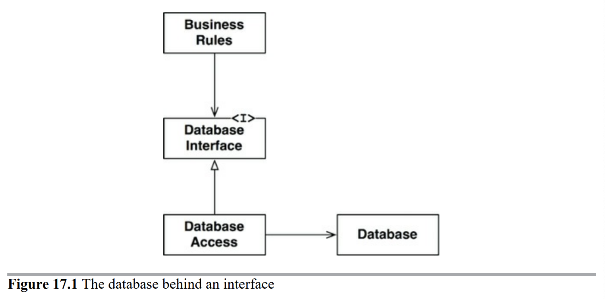
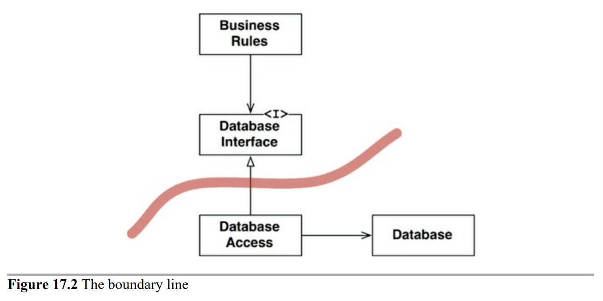
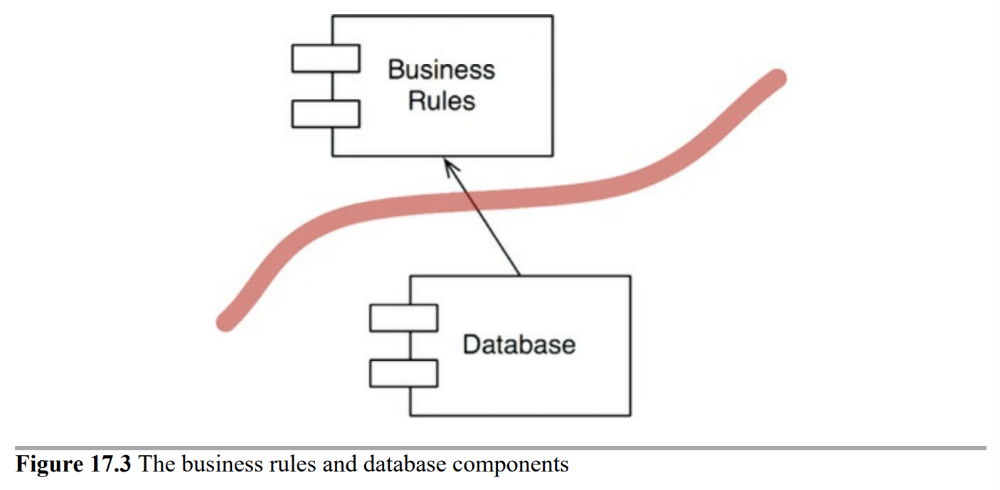
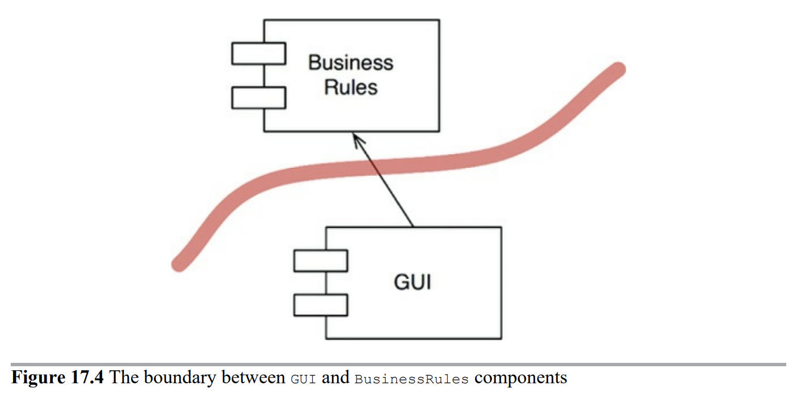
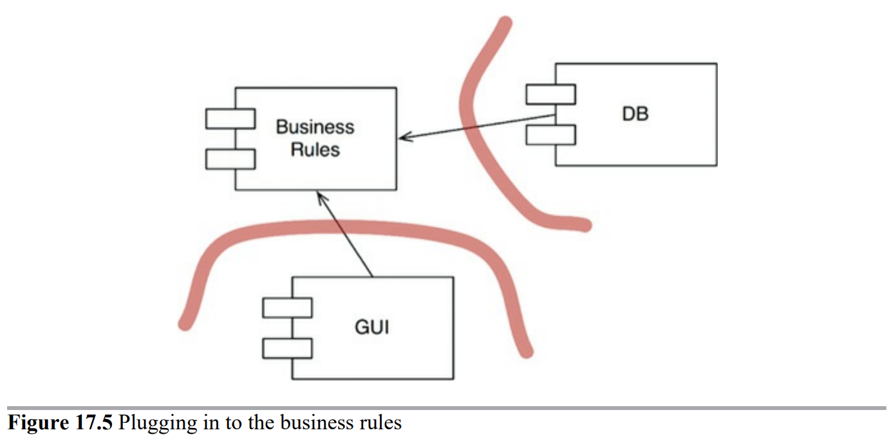

# 17장 경계: 선 긋기

소프트웨어 아키텍처는 선을 긋는 기술이며, 저자는 이러한 선을 경계(boundary)라고 부른다.

경계는 소프트웨어 요소를 서로 분리하고, 경계 건너에 있는 요소를 알지 못하도록 막는다.

## P 회사 사례

너무 이른 결정으로 결합이 발생하여 인적 자원의 효율을 떨어뜨린 사례

1980년대 P사의 창립자들은 간단한 모놀리틱 데스크톱 앱을 만들었다.  
1990년대 후반이 되자 웹이 대세가 되었고, 고객들은 웹 버전을 강하게 요구.

웹 버전 개발을 위해 고용된 자바 프로그래머들은 대규모 서버 확장을 이상적으로 상상했기 때문에, 비즈니스 로직을 서버에 두껍게 쌓은 3계층 구조를 채택하고, 여러 서버에 분산 시켜 고성능 시스템을 만들고자 했다.

```
                 [사용자들]
                     │
       ┌───────────────────────────┐
       │        LoadBalancer       │  ← 트래픽 분산
       └───────────────────────────┘
         │           │            │
    ┌────┴────┐ ┌────┴────┐ ┌─────┴───┐
    │  App1   │ │  App2   │ │  App3   │   ← 서버 팜 (동일한 앱 복제본)
    └─────────┘ └─────────┘ └─────────┘
                     │
                [Database]
```

| 계층                             | 역할        | 예시                     |
| ------------------------------ | --------- | ---------------------- |
| **Presentation Layer (UI)**    | 사용자 인터페이스 | JSP, React, HTML       |
| **Application/Business Layer** | 핵심 로직 처리  | Spring, EJB, 서비스 클래스   |
| **Data Layer**                 | 데이터 접근    | DB, JPA, JDBC, MyBatis |

서버 팜에는 GUI를 위한 서버, 미들웨어 서버, 데이터베이스 서버가 있었을 것이다.

이들은 모든 도메인 객체가 세 가지 인스턴스를 가져야 한다는 너무 이른 결정을 내렸다.  
이 인스턴스들은 서로 다른 머신에 상주했기 때문에 프로세서 간, 티어 간 통신이 필요했다.

P사는 서버 팜을 필요로 하는 시스템을 한 번도 판매하지 못했다.  
배포했던 시스템은 모두 단일 서버였다.

그럼에도 세 개의 실행 파일 모두를 단일 장비에서, 세 개의 서로 다른 프로세스로 실행해가며 수 년간 개발했다.

필요도 없는 프로세스간 통신 로직을 사용해가면서.

## 어떻게 선을 그을까? 언제 그을까?

관련이 있는 것과 없는 것 사이에 선을 긋는다.

GUI, 업무 규칙, DB 사이에는 아무 관련이 없다. 반드시 선이 있어야 한다.

업무 규칙이 DB를 신경 쓰지 않아야 한다는 부분에 동의하지 못하는 사람들도 있겠다.  
심지어 업뮤 규칙이 구체화된 것이 데이터베이스라고 확신하는 사람도 있다.

하지만 그렇지 않다.

업무 규칙이 알아야 할 것은 데이터를 가져오고 저장할 때 사용할 수 있는 함수 집합이 있다는 사실이 전부다.

우리는 데이터베이스를 인터페이스 뒤로 숨길 수 있다.



경계선은 상속 관계를 횡단하면서 Database Interface 바로 아래에 그어진다.



이 도표에서 Database Access가 존재한다는 사실을 알고 있는 클래스는 없다.

업무 규칙이 포함된 컴포넌트, DB와 DB 접근 클래스를 포함하는 컴포넌트를 살펴보면 다음과 같다.  
DatabaseInterface는 BusinessRules 컴포넌트에 속하며, DatabaseAccess 클래스는 Database 컴포넌트에 속한다.



이 선의 방향이 중요하다.

BusinessRules는 Database를 알지 못한다. 또한 Database는 BusinessRules 없이는 존재할 수 없다.

따라서 BusinessRules에서는 어떤 종류의 데이터베이스도 사용할 수 있음을 알 수 있다.

## 입력과 출력은?

마찬가지로 GUI와 BusinessRules 컴포넌트가 경계선에 의해 분할된다.



## 플러그인 아키텍처

DB와 GUI 컴포넌트를 합쳐서 보면 컴포넌트 추가와 관련된 패턴을 볼 수 있다.  
이 패턴은 시스템에서 서드파티 플러그인을 사용할 수 있게 한 바로 그 패턴과 동일하다.



## 결론

소프트웨어 아키텍처에서 경계선을 그리려면 먼저 시스템을 컴포넌트 단위로 분할해야 한다.

일부 컴포넌트는 핵심 업무 규칙, 나머지는 플러그인이다.

컴포넌트 사이의 화살표가 핵심 업무를 향하도록 컴포넌트의 소스를 배치한다.

이것은 의존성 역전 원칙과 안정된 추상화 원칙을 응용한 것이다.  
의존성 화살표는 저수준 세부사항에서 고수준의 추상화를 향하도록 배치된다.