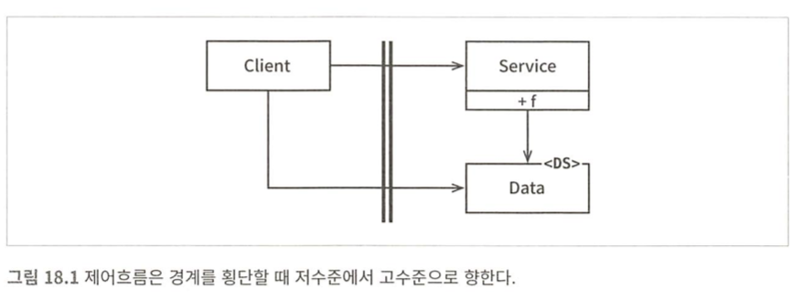
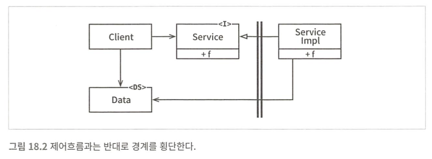

# 18장 경계 해부학

시스템 아키텍처는 컴포넌트와 컴포넌트들을 분리하는 경계에 의해 정의된다.  
이러한 경계는 여러 형태로 나타난다.

## 경계 횡단하기

'경계를 횡단한다' 함은 경계 한쪽에 있는 기능에서 반대편 기능을 호출하여 데이터를 전달하는 일에 불과하다.

적절한 위치에서 경계를 횡단하도록 만들려면 소스 코드 의존성 관리를 잘 해야 한다.  
모듈 하나가 변경되면, 의존하는 다른 모듈도 변경하거나 새로 배포해야 할 수 있기 때문

경계는 이런 변경이 전파되는 것을 막는 방화벽 역할을 한다.

## 두려운 단일체

아키텍처 경계 중 가장 단순하고 흔한 형태는 물리적으로 엄격하게 구분되지 않는 형태다.  
함수와 데이터가 단일 프로세서에서 주소 공간을 공유하는 구조. (소스 수준 분리 모드)

배포 관점에서 이런 단일체는 하나의 실행 파일에 불과하고, 경계가 드러나지 않는다.  
그렇다고 경계가 없거나 무의미하다는 것은 아니다. 하나의 파일 내에 독립적인 컴포넌트들이 얼마든지 있을 수 있음

이런 아키텍처는 대부분 특정한 동적 다형성에 의존한다.  
그 덕분에 최근 수십 년 동안 객체 지향이 중요한 패러다임이 될 수 있었다.

가장 단순한 형태의 경계 횡단은 저수준 클라이언트에서 고수준 서비스로 향하는 함수 호출이다.  
런타임 의존성과 컴파일타임 의존성은 모두 같은 방향(저수준 -> 고수준)으로 향한다.



<details><summary>코드 예시</summary>

```java
// ───────── highlevel/service/Data.java ─────────
package highlevel.service;

public class Data {          // <DS> (서비스 쪽에 정의)
    public final String msg;
    public Data(String msg) { this.msg = msg; }
}

// ───────── highlevel/service/Service.java ─────────
package highlevel.service;

public class Service {
    public void f(Data d) {  // Client가 Data를 알아야 호출 가능
        System.out.println("Service.f: " + d.msg);
    }
}

// ───────── lowlevel/client/Client.java ─────────
package lowlevel.client;

// 컴파일타임 의존성: lowlevel -> highlevel
import highlevel.service.Data;     // ◀︎ Data를 알게 됨(결합 ↑)
import highlevel.service.Service;  // ◀︎ Service도 알게 됨

public class Client {
    private final Service service;

    public Client(Service service) { this.service = service; }

    public void run() {             // 제어 흐름: Client -> Service
        service.f(new Data("hello from client"));
    }

    public static void main(String[] args) {
        Client c = new Client(new Service());
        c.run();
    }
}
```
</details>

---

고수준 클라이언트가 저수준 서비스를 호출해야 한다면 동적 다형성을 사용하여 제어흐름과 반대로 의존성을 역전시킬 수 있다.  
런타임 의존성은 컴파일타임 의존성과는 반대가 된다.



제어흐름은 그림 18.1 처럼 왼쪽에서 오른쪽으로 경계를 횡단한다.  
의존성은 오른쪽에서 왼쪽으로(고수준 컴포넌트 쪽으로) 향한다.  
데이터 구조 정의가 의존성이 향하는 쪽에 위치하는 점도 주목해야한다.(고수준에 위치 해야 저수준 컴포넌트에 끌려다니지 않음)

<details> <summary> 코드 예시 </summary>

```java
// ───────── highlevel/policy/Service.java ─────────
package highlevel.policy;

public interface Service {          // <I> 고수준 인터페이스
    void f(Data d);
}

// ───────── highlevel/policy/Data.java ─────────
package highlevel.policy;

public class Data {                 // <DS> 고수준(호출자/정책)에 정의
    public final String msg;
    public Data(String msg) { this.msg = msg; }
}

// ───────── lowlevel/impl/ServiceImpl.java ─────────
package lowlevel.impl;

// 컴파일타임 의존성: lowlevel -> highlevel (인터페이스/DS를 의존)
import highlevel.policy.Data;
import highlevel.policy.Service;

public class ServiceImpl implements Service {   // 저수준 구현
    @Override
    public void f(Data d) {
        System.out.println("ServiceImpl.f: " + d.msg);
    }
}

// ───────── highlevel/app/Client.java ─────────
package highlevel.app;

// 고수준은 자신의 인터페이스/DS만 앎 (저수준 구현은 모름)
import highlevel.policy.Data;
import highlevel.policy.Service;

// (실제 조립은 main에서 의존성 주입으로 해결)
public class Client {
    private final Service service;
    public Client(Service service) { this.service = service; }

    public void run() {              // 제어 흐름: Client -> (저수준)ServiceImpl
        service.f(new Data("hello from client"));
    }
}

// ───────── composition/Main.java ─────────
package composition;

import highlevel.app.Client;
import highlevel.policy.Service;
import lowlevel.impl.ServiceImpl;    // 조립 단계에서만 저수준을 앎

public class Main {
    public static void main(String[] args) {
        Service svc = new ServiceImpl(); // 의존성 주입(런타임 바인딩)
        Client client = new Client(svc);
        client.run();
    }
}
```
</details>

모노리틱 구조의 실행 파일이라도 이처럼 구조를 분리하면 개발, 테스트, 배포에 큰 도움이 된다.

## 배포형 컴포넌트

아키텍처의 경계가 물리적으로 드러날 수도 있는데, 가장 단순한 형태는 동적 링크 라이브러리다.  
.NET DLL, 자바 jar, 루비 젬, 유닉스 공유 라이브러리 등

컴포넌트를 이런 형태로 배포하면 따로 컴파일하지 않고 바로 사용할 수 있다.  
(배포 수준 결합 분리 모드)

배포 과정에서만 차이가 날 뿐, 단일 파일 형태에서와 경계를 넘는 논리적 구조는 동일하다.(호출 방식, 의존성 방향 등)

## 스레드

단일체와 배포형 컴포넌트는 모두 스레드를 활용할 수 있다.  
스레드는 아키텍처 경계도 아니고, 배포 단위도 아니다. 실행 계획과 순서를 체계화하는 방법에 가깝다.

## 로컬 프로세스

훨씬 강한 물리적 형태를 띠는 아키텍처 경계로 로컬 프로세스가 있다.  
로컬 프로세스들은 동일한 프로세서 또는 하나의 멀티코어 시스템에 속한 여러 프로세서들에서 실행되지만, 독립된 주소 공간을 갖는다.

소켓이나 메일박스, 메시지 큐 같은 기능으로 통신한다.

각 로컬 프로세스는 여러 컴포넌트를 정적으로 묶거나, 동적으로 연결된 컴포넌트들의 집합일 수 있다.

아키텍처 관점에서는 모노리틱, 바이너리 컴포넌트의 경우와 동일하게 고수준 컴포넌트를 향한 의존성 방향을 유지해야 한다.

따라서 로컬 프로세스에서는 고수준 프로세스의 소스 코드가 저수준 프로세스의 이름, 물리 주소, 레지스트리 조회 키를 절대로 포함해서는 안 된다.

프로세스 간 통신은 비싼 작업이므로 신중히 제한해야 한다.

## 서비스

물리적인 형태를 띠는 가장 강력한 경계는 바로 서비스다.

서비스는 자신의 물리적 위치에 구애받지 않는다.  
서로 통신하는 서비스는 물리적으로 동일한 프로세서나 멀티코어에서 동작할 수도 있고, 아닐 수도 있다.

서비스 경계를 지나는 통신은 함수 호출에 비해 매우 느리다(네트워크).  
따라서 가능하다면 빈번하게 통신하는 일을 피하고, 지연에 따른 문제를 고수준에서 처리할 수 있어야 한다.

그 외에는 로컬 프로세스에 적용한 규칙이 서비스에도 그대로 적용된다.  
고수준 서비스의 소스 코드에는 저수준 서비스를 특정 짓는 어떤 물리적 정보(URI 등)도 절대 포함해서는 안된다.
