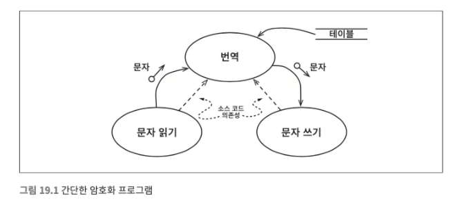
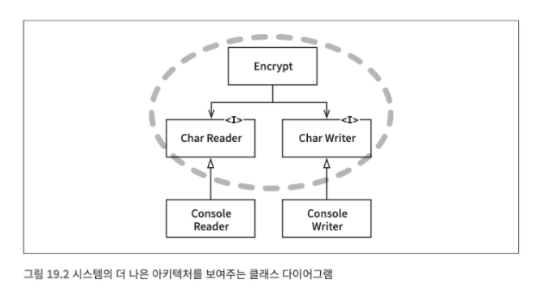

# 19장 정책과 수준

소프트웨어 시스템은 정책을 기술한 것이다.  
이 정책은 여러 개의 조그만 정책들로 쪼갤 수 있다.

이러한 정책을 신중하게 분리하고, 정책이 변경되는 양상에 따라 정책을 재편성하는 일이 소프트웨어 아키텍트가 하는 일이다.

동일한 이유로 동일한 시점에 변경되는 정책은 같은 수준, 같은 컴포넌트에  
서로 다른 이유로, 혹은 다른 시점에 변경되는 정책은 다른 수준, 다른 컴포넌트로 분리해야 한다.

## 수준

수준(level)은 '입력과 출력까지의 거리'이다.  
입력과 출력 모두로부터 멀리 위치할 수록 정책의 수준은 높아진다.



번역 컴포넌트는 입력과 출력에서부터 가장 멀리 떨어져 있기 때문에 최고 수준 컴포넌트다.

데이터 흐름과 소스 코드 의존성이 항상 같은 방향을 가리키지 않는다.  
소스 코드 의존성은 그 수준에 따라 결합되어야 한다.

잘못하면 아래 같은 코드가 만들어진다.

``` c
function encrypt() {
    while(true) writeChar(translate(readChar()));
}
```

고수준 encrypt 함수가 저수준 readChar와 writeChar 함수에 의존하기 때문에 잘못된 아키텍처다.



개선된 아키텍처다.  
점선으로 된 경계를 주목

경계를 횡단하는 의존성은 모두 경계 안쪽으로 향한다.  
경계로 묶인 영역이 이 시스템에서 최고 수준의 구성요소다.

입출력 방식에 변화가 생겨도 암호화 정책은 거의 영향을 받지 않는다.

이처럼 모든 소스 코드 의존성의 방향이 고수준 정책을 향할 수 있도록 정책을 분리했다면 변경의 영향도를 줄일 수 있다.

## 결론

이 장에서의 정책에 대한 논의는 단일 책임 원칙, 개방 폐쇄 원칙, 공통 폐쇄 원칙, 의존성 역전 원칙, 안정된 의존성 원칙, 안정된 추상화 원칙을 모두 포함한다.