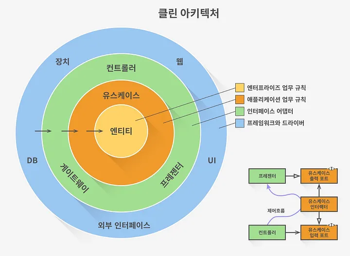
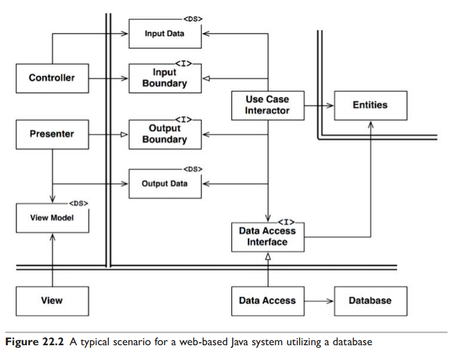

# 22장 클린 아키텍처

수십 년간 시스템 아키텍처와 관련된 여러 아이디어가 있어왔다.

* Hexagonal Architecture: 포트와 어댑터  
    ([헥사고날 아키텍처를 적용한 URL 단축기 토이 프로젝트 구경하기](https://github.com/column-wise/short-link/tree/dev/BE))
* DCI(Data, Context and Interaction)
* BCE(Boundary-Control-Entity)

이 아키텍처들은 세부적인 면에서는 차이가 있더라도 내용은 상당히 비슷하다.  
핵심은 소프트웨어 계층을 분리하여 관심사의 분리를 이뤄내는 것이다.

이들 아키텍처는 모두 시스템이 다음과 같은 특징을 지니도록 만든다.

* 프레임워크 독립성
* 테스트 용이성
* UI 독립성
* 데이터베이스 독립성
* 모든 외부 에이전시에 대한 독립성



## 의존성 규칙

그림 22.1에서 각각의 동심원은 소프트웨어에서 서로 다른 영역을 표현한다.  
안으로 들어갈수록 고수준의 소프트웨어가 된다.

이러한 아키텍처가 동작하도록 하는 가장 중요한 규칙은 의존성 규칙  
> 소스 코드 의존성은 반드시 안쪽으로, 고수준의 정책을 향해야 한다.

내부의 원은 외부 원에 속한 어떤 것도 알지 못한다.  
내부에서는 외부의 원에 선언된 어떤 것에 대해서도 그 이름은 언급해서는 절대 안된다.

### 엔티티

엔티티는 전사적인 핵심 업무 규칙을 캡슐화한다.  
엔티티는 메서드를 갖는 객체거나 일련의 데이터 구조와 함수의 집합일 수도 있다.  
그 형태는 중요하지 않다.

```java
// 메서드를 갖는 객체
class Loan {
    double principal;
    double rate;
    int period;

    void applyInterest() {
        principal += principal * rate;
    }
}
```

``` c
// 데이터 구조 + 함수 집합
typedef struct {
    double principal;
    double rate;
    int period;
} Loan;

void applyInterest(Loan* loan) {
    loan->principal += loan->principal * loan->rate;
}
```

외부의 무언가가 변경되더라도 엔티티가 변경될 가능성은 지극히 낮다.

### 유스케이스

유스케이스 계층의 소프트웨어는 애플리케이션에 특화된 업무 규칙을 포함한다.

엔티티로 들어오고 나가는 데이터 흐름을 조정하며, 엔티티가 자신의 핵심 업무 규칙을 사용해서 유스케이스의 목적을 달성하도록 이끈다.

이 계층에서 발생한 변경이 엔티티에 영향을 줘서는 안된다. 또한 외부 요소에서 발생한 변경이 이 계층에 영향을 줘서도 안 된다.

### 인터페이스 어댑터

이 계층은 프레젠터, 뷰, 컨트롤러 등을 포함한다.  
데이터를 임의의 프레임워크(DB)가 이용하기에 가장 편리한 형식으로 변환한다.  
이 원 안쪽에 속한 어떤 코드도 DB에 대해 조금도 알아서는 안 된다.

### 프레임워크와 드라이버

가장 바깥쪽 계층은 일반적으로 DB나 웹 프레임워크 같은 프레임워크나 도구들로 구성된다.

### 원은 네 개여야만 하나?

항상 네 개만 사용해야 한다는 규칙은 없다. 하지만 어떤 경우에도 의존성 규칙은 적용된다.  
소스 코드 의존성은 항상 안쪽을 향한다.  
안쪽으로 이동할 수록 추상화와 정책의 수준은 높아진다.

### 경계 횡단하기

제어흐름은 컨트롤러에서 시작해서, 유스케이스를 지난 후, 프레젠터에서 실행되면서 마무리된다.

유스케이스에서 프레젠터를 호출할 때,  
직접 호출해버리면 의존성 규칙을 위배하기 때문에 우리는 유스케이스가 내부 원의 인터페이스(유스케이스 출력 포트)를 호출하도록 하고, 외부 원의 프레젠터가 그 인터페이스를 구현하도록 만든다.

아키텍처 경계를 횡단할 때 언제라도 동일한 기법을 사용할 수 있다.  
우리는 동적 다형성을 이용하여 소스 코드 의존성을 제어흐름과는 반대로 만들 수 있고, 제어흐름이 어느 방향으로 흐르더라도 의존성 규칙을 준수할 수 있다.

### 경계를 횡단하는 데이터는 어떤 모습인가

기본적인 구조체나 간단한 데이터 전송 객체(DTO)등 원하는 대로 선택할 수 있다.

중요한 점은 격리되어 있는 간단한 데이터 구조가 경계를 가로질러 전달된다는 것이다.  
우리는 데이터 구조가 어떤 의존성을 가져 의존성 규칙을 위배하게 되는 일은 바라지 않는다.

따라서 경계를 가로질러 데이터를 전달할 때, 데이터는 항상 내부의 원에서 사용하기에 가장 편리한 형태를 가져야만 한다.

## 전형적인 시나리오

DB를 사용하는 웹 기반 자바 시스템의 전형적인 시나리오다.



웹 서버는 사용자로부터 입력 데이터를 모아 Controller로 전달한다.  
Controller는 데이터를 POJO로 묶은 후 InputBoundary 인터페이스를 통해 UseCaseInteractor로 전달한다.

UseCaseInteractor는 DataAccessInterface를 사용하여 Entities가 사용할 데이터를 DB에서 불러와서 메모리에 로드한다.

Entities가 완성되면 UseCaseInteractor는 Entities로부터 데이터를 모아 또 다른 POJO인 OutputData를 구성한다.

OutputData는 OutputBoundary 인터페이스를 통해 Presenter로 전달된다.

Presenter는 OutputData를 ViewModel로 재구성하는 일을 한다.  
OutputData에는 Date 객체가 포함될 수 있겠으나, ViewModel에는 사용자가 보기 편한 문자열 형태로 변환되어 들어갈 것이다.

View에서는 ViewModel을 화면에 출력한다.

모든 의존성은 경계선을 안쪽으로 가로지르며, 의존성 규칙을 준수한다.

## 결론

소프트웨어를 계층으로 분리하고, 의존성 규칙을 준수한다면 본질적으로 테스트하기 쉬운 시스템을 만들게 될 것이며, 그에 따른 이점을 누릴 수 있다.

DB나 웹 프레임워크 같은 시스템의 외부 요소가 구식이 되더라도, 이것들을 어렵지 않게 교체할 수 있다.