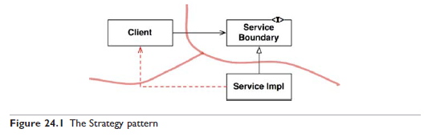
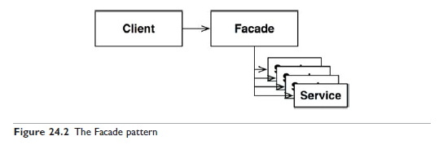

# 24장 부분적 경계

아키텍처 경계를 완벽하게 만드는 데는 비용이 많이 든다.  
쌍방향 다형적 인터페이스(InputBoundary, OutputBoundary), Input과 Output을 위한 데이터 구조, 두 영역을 독립적으로 컴파일하고 배포할 수 있는 컴포넌트로 격리하는 데 필요한 모든 의존성을 관리해야 한다.

이런 종류의 선행적인 설계는 YAGNI(You Aren't Going to Need It) 원칙을 위배하지만, 아키텍트라면 '하지만 어쩌면 필요할지도' 라는 생각이 들 수 있다.  
만약 그렇다면 부분적 경계(partial boundary)를 구현해볼 수 있다.

## 마지막 단계를 건너뛰기

부분적 경계를 생성하는 방법 중 하나는 독립적으로 컴파일하고 배포할 수 있는 컴포넌트를 만들기 위한 작업은 모두 수행한 후, 단일 컴포넌트에 그대로 모아만 두는 것이다.

부분적 경계를 만들려면 완벽한 경계를 만들 때 만큼의 코드량과 사전 설계가 필요하다.  
하지만 다수의 컴포넌트를 관리하는 작업은 하지 않아도 된다.

## 일차원 경계

완벽한 형태의 아키텍처 경계는 양방향으로 격리된 상태를 유지해야 하므로 쌍방향 Boundary 인터페이스를 사용한다. 하지만 관리 비용이 많이 든다.

아래 그림이 추후 완벽한 경계로 확장할 수 있는 공간을 확보하고자 할 때 사용할 수 있는 구조다.

전략 패턴을 활용한 사례.  
ServiceBoundary 인터페이스는 클라이언트가 사용하고, ServiceImpl 클래스가 구현한다.

Client를 ServiceImpl로부터 격리시키는 데 필요한 의존성 역전이 이미 적용되어 있다.

하지만 이러한 분리는 매우 빠르게 붕괴될 수 있다.  
Client가 ServiceImpl에 종속되기 매우 쉽기 때문인데,  

예를 들어 Client에서 ServiceImpl의 특정 메서드를 필요로 해서 인터페이스에 메서드를 추가하다보면  
인터페이스가 구현체의 모양을 따라가게 되고,  
추상화가 아니라 단순히 구현체의 시그니처 복사본의 모양으로 진화하기 매우 쉽기 때문이다.

## 퍼사드

훨씬 더 단순한 경계는 퍼사드 패턴이다. 

이 경우에는 의존성 역전까지도 사용하지 않는다.  
경계는 Facade 클래스로만 간단히 정의되고, 서비스 호출이 발생하면 해당 서비스 클래스로 호출을 전달한다.

클라이언트는 이들 서비스 클래스에 직접 접근할 수 없다.

하지만 클라이언트는 이 모든 서비스 클래스에 추이 종속성을 갖게 되므로 정적 언어라면 서비스 클래스 하나에서 변경이 발생하면 클라이언트까지 재컴파일 해야 한다.

## 결론

소개된 세 가지 전략 외에도 많은 방법이 있다.  
각각의 접근법은 나름의 장단점을 지닌다. 또한 해당 경계가 실제로 구체화되지 않으면 가치가 떨어질 수 있다.

아키텍처 경계가 언제, 어디에 존재해야 할지, 그리고 그 경계를 완벽하게 구현할지, 부분적으로 구현할지를 결정하는 일 또한 아키텍트의 역할이다.