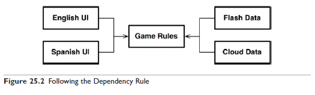
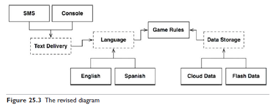
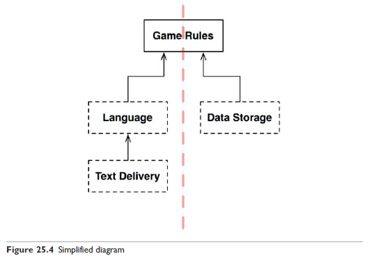
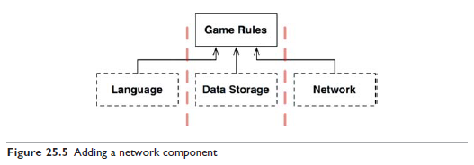
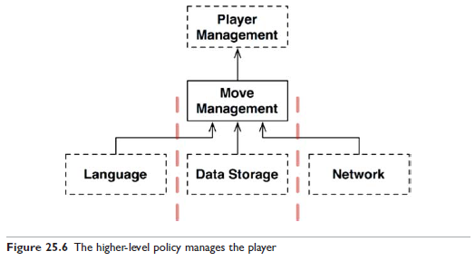
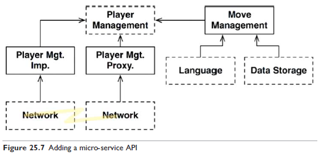

# 25장 계층과 경계

## 움퍼스 사냥 게임

텍스트를 기반으로 하는 'Hunt the Wumpus' 게임 예시

`GO EAST`, `SHOOT WEST`와 같은 단순한 명령어를 사용한다.

텍스트 기반 UI는 그대로 유지하고, 게임 규칙과 UI를 분리해서 제품을 여러 시장에서 다양한 언어로 발매할 수 있게 만든다고 가정해 보자.

게임 규칙은 언어 독립적인 API를 사용해서 UI 컴포넌트와 통ㅇ신하고, UI는 API를 사람이 이해할 수 있는 언어로 변환할 것이다.

UI 컴포넌트가 어떤 언어를 사용하더라도 게임 규칙은 제사용할 수 있다.

또한 게임의 상태는 플래시 메모리, 클라우드 또는 RAM을 이용해서 저장소에 유지할 수 있다.

## 클린 아키텍처?

중요한 아키텍처 경계를 모두 발견한 것일까?

예를 들어, UI에서 언어가 유일한 변경의 축은 아니다. 텍스트 주고받는 메커니즘을 다양하게 만들고 싶을 수도 있다.(shell, 텍스트 메시지, 채팅 애플리케이션 등)

따라서 해당 경계를 가로지르는, 언어를 통신 메커니즘으로부터 격리하는 API를 생성해야 할 수도 있다.

점선으로 된 테두리는 API를 정의하는 추상 컴포넌트를 가리킨다.

GameRules를 보면 GameRules 내부 코드에서 사용하고 Language 내부 코드에서 구현하는 다형적 Boundary 인터페이스를 발견할 수 있다.  
또한 Language에서 사용하고 GameRules 내부 코드에서 구현하는 다형적 Boundary인터페이스도 발견할 수 있다.

Language를 들여다보아도 같은 구조를 발견할 수 있다.

이 모든 경우에 해당 Boundary 인터페이스가 정의하는 API는 의존성 흐름의 상위에 위치한 컴포넌트에 속한다.

단순화 하면 위 그림과 같다. 모든 화살표가 위를 향하는 것에 주목하자.

데이터 흐름은  
사용자 -> Text Delivery -> Language -> Game Rules -> Data Storage  
Game Rules -> Language -> Text Delivery -> 사용자

## 흐름 횡단하기

이 예제에서 데이터 흐름은 항상 두 가지일까?

멀티 플레이를 지원한다고 하면 Network 컴포넌트를 추가해야 한다.  

이 구성은 데이터 흐름을 세 개의 흐름으로 분리하며, 이들 흐름은 모두 GameRules가 제어한다.

## 흐름 분리하기

모든 흐름이 상단의 단일 컴포넌트에서 서로 만난다고 생각할 수 있다. 하지만 현실은 훨씬 복잡하다.

GameRules 컴포넌트의 일부는 지도와 관련된 메커니즘을 처리한다.  
동굴의 연결, 동굴 내 오브젝트의 위치, 플레이어의 이동, 플레이어가 처리해야 할 이벤트 등

또, 더 높은 수준에는 플레이어의 생명력, 특정 사건을 해결하는 비용과 보상 등을 담고 있는 정책도 있다.  
그리고 이 정책이 게임이 끝났을 때 승리 여부도 결정할 것이다.

대규모 플레이어가 동시에 플레이할 수 있는 버전의 움퍼스 사냥 게임을 가정해보자.

MoveManagement는 플레이어의 컴퓨터에서 처리되지만 PlayerManagement는 서버에서 처리된다.  
MoveManagement와 PlayerManagement 사이에는 완벽한 형태의 아키텍처 경계가 존재한다.

## 결론

간단한 프로그램으로 아키텍처 경계를 모두 추론하는 예제를 가져온 이유는 아키텍처 경계가 어디에나 존재한다는 사실을 보여주기 위함이다.

우리는 아키텍처 경계가 언제 필요한지 신중하게 파악해내야 한다.  
또한 이러한 경계를 제대로 구현하려면 비용이 많이 든다는 사실도 인지하고 있어야 한다.  
경계가 무시되었다면 나중에 다시 추가하는 비용이 크다는 사실도 알아야 한다.

하지만 추상화가 필요하리라고 미리 예측해서는 안된다.  
YAGNI(You Aren't Going to Need It)  
오버 엔지니어링이 언더 엔지니어링보다 나쁠 때가 훨씬 많기 때문이다.

당신은 현명하게 추측해야만 한다...  
어디에 아키텍처 경계를 둬야 할지, 완벽하게 구현할 경계는 무엇인지, 부분적으로 구현할 경계와 무시할 경계는 무엇인지...

시스템이 발전함에 따라 주의를 기울여야 한다.  
경계가 필요할 수도 있는 부분에 주목하고, 경계가 존재하지 않아 생기는 마찰의 첫 조짐을 신중하게 관찰해야 한다.

목표를 달성하려면 빈틈없이 지켜봐야 한다.