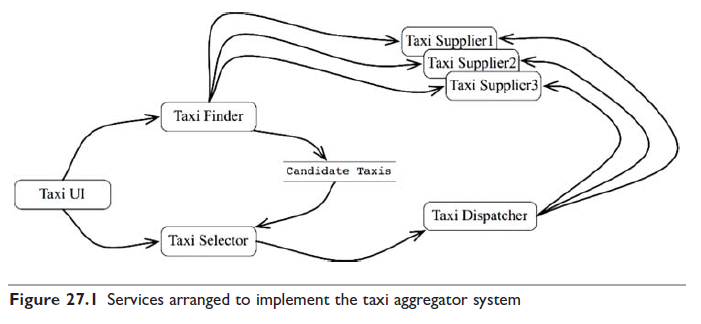
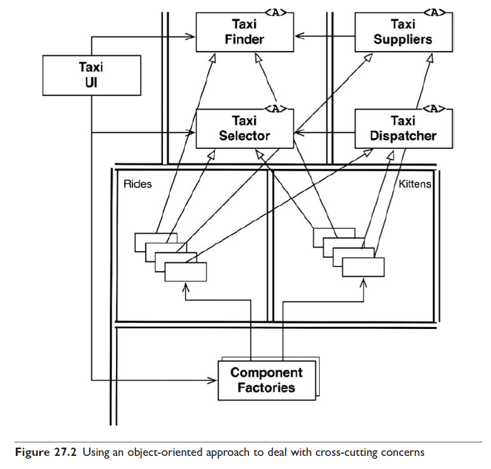
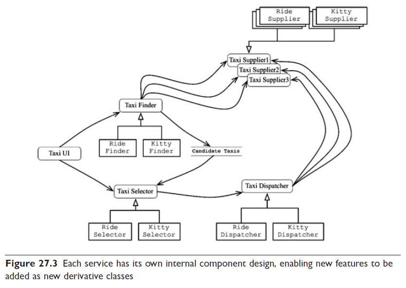
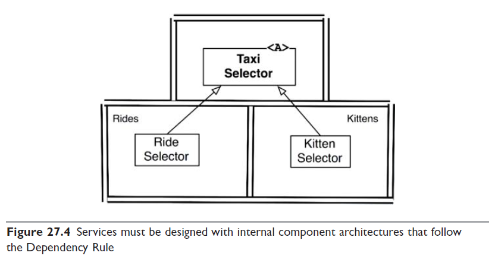

# 27장 '크고 작은 모든' 서비스들

서비스 지향 '아키텍처'와 마이크로서비스 '아키텍처'는 최근 큰 인기를 끌고 있다.
- 서비스를 사용하면 상호 결합이 철저하게 분리되는 것처럼 보임
- 서비스를 사용하면 개발과 배포 독립성을 지원하는 것처럼 보임

하지만 이것들은 일부만 맞는 말이다.

## 서비스 아키텍처?

시스템의 아키텍처는 고수준의 정책을 저수준의 세부사항으로부터 부리하는 경계에 의해 정의된다.  
단순히 애플리케이션의 행위를 분리할 뿐인 서비스라면 값비싼 함수 호출에 불과하며, 아키텍처 관점에서 꼭 중요하다고 볼 수는 없다.

서비스 그 자체론느 아키텍처를 정의하지 않는다.

## 서비스의 이점?

### 결합 분리의 오류

시스템을 서비스들로 분리함으로써 얻게 되는 큰 이점 하나는 서비스 사이의 결합이 확실히 분리된다는 점이다.

하지만 꼭 그런 것만은 아닌데, 프로세서 내 또는 네트워크 상의 공유 자원 때문에 결합될 가능성이 여전히 존재한다.

### 개발 및 배포 독립성의 오류

또 다른 이점은 전담팀이 서비스를 소유하고 운영한다는 점이다.  
이러한 개발 및 배포 독립성은 확장 가능한 것으로 간주된다.

대규모 엔터프라이즈 시스템을 독립적으로 개발하고 배포 가능한 수십~수천 개의 서비스들을 이용하여 만들 수 있다고 믿는다.  
하지만 모놀리틱 시스템이나 컴포넌트 기반 시스템으로도 구축할 수 있다는 사실은 역사적으로 증명되어 왔다.

## 야옹이 문제

9장에서 예를 들었던 택시 통합 시스템을 다시 살펴보자.

이 시스템은 해당 도시에서 운영되는 많은 택시 업체를 알고있고, 고객은 승차 요청을 할 수 있었다.  
고객은 승차 시간, 비용, 고급 택시 여부, 운전사 경력 등 다양한 기준에 따라 택시를 선택할 수 있다고 가정하자.

- TaxiUI 서비스가 고객을 담당, 고객은 모바일 기기로 택시를 호출
- TaxiFinder 서비스가 TaxiSupplier를 통해 후보 택시들을 선별
- TaxiSelector 서비스가 사용자 설정에 따라 후보 중 적합한 택시를 선택
- TaxiDispatcher 서비스가 해당 택시에 배차 지시

시스템을 운영하던 중, 마케팅 부서에서 도시에 야옹이를 배달하는 서비스를 제공하겠다는 계획을 발표한다.(?)  
사용자는 자신의 집이나 사무실로 야옹이를 배달해달라고 주문할 수 있다.

- 회사는 도시 전역에 야옹이를 태울 다수의 승차 지점을 설정해야 한다.
- 야옹이 배달 주문이 오면, 근처의 택시가 선택되고, 승차 지점 중 한 곳에서 야옹이를 태운 후, 올바른 주소로 야옹이를 배달한다.

택시 업체 중 참여를 거부하는 업체도 분명 있을 수 있다.  
어떤 운전자는 고양이 알러지가 있을 수 있기 때문에 해당 운전자는 이 서비스에서 제외되어야 한다.  
택시 승객 역시 알러지가 있을 수 있으므로 배차를 신청한 고객이 알러지가 있다고 밝힌 경우라면 지난 3일 사이에 야옹이를 배달했던 차량은 배차되지 않아야 한다.

이 기능을 구현하려면 이들 서비스 중 어디를 변경해야 할까? `전부다.`  
이 서비스들은 모두 결합되어 있어서 독립적으로 개발하고, 배포하거나 유지될 수 없다.

이것이 바로 횡단 관심사가 지닌 문제다.  
같은 종류의 기능적 분해는 새로운 기능이 기능적 행위를 횡단하는 상황에 매우 취약하다.

## 객체가 구출하다

SOLID 설계 원칙을 잘 들여다보면, 다형적으로 확장할 수 있는 클래스 집합을 생성해 새로운 기능을 처리하도록 함을 알 수 있다.

원래 서비스의 로직 중 대다수가 이 객체 모델의 기반 클래스들 내부로 녹아들었다.  
배차에 특화된 로직은 Rides 컴포넌트로 추출되고, 야옹이에 대한 신규 기능은 Kittens 컴포넌트에 들어갔다.

이 두 컴포넌튼느 기존 컴포넌트들에 있는 추상 기반 클래스를 템플릿 메서드나 전략 패턴 등을 이용해서 오버라이드한다.

두 개의 신규 컴포넌트인 Rides나 Kittens가 의존성 규칙을 준수, 이 기능들을 구현하는 클래스들은 UI의 제어 하에 팩토리가 생성한다는 사실을 주목하자.

TaxiUI는 어쩔 수 없이 변경해야 하지만 그 외의 것들은 변경할 필요가 없다.  
대신 야옹이 기능을 구현한 새 jar 파일이나 젬, DLL을 시스템에 추가하고 런타임에 동적으로 로드하면 된다.

## 컴포넌트 기반 서비스

서비스에도 이렇게 할 수 있을까? 물론 가능하다.  
서비스는 SOLID 원칙대로 설계할 수 있으며 컴포넌트 구조를 갖출 수도 있다.  
기존 컴포넌트들을 변경하지 않고도 새로운 컴포넌트를 추가할 수 있다.

개로운 기능 추가 혹은 기능 확장은 새로운 jar 파일로 만든다. 이때 새로운 jar 파일을 구성하는 클래스들은 기존 jar 파일에 정의된 추상 클래스들을 확장해서 만들어진다.  
그러면 새로운 기능 배포는 서비스를 재배포하는 문제가 아니라, 서비스를 로드하는 경로에 새로운 jar 파일을 추가하는 문제가 된다.  
따라서 개방 폐쇄 원칙을 준수하게 된다.

## 횡단 관심사

아키텍처 경계는 서비스 사이에 있지 않다.

모든 주요 시스템이 직면하는 횡단 관심사를 처리하려면, 서비스 내부는 의존성 규칙도 준수하는 컴포넌트 아키텍처로 설계해야 한다.

아키텍처 경계를 정의하는 것은 서비스 내에 위치한 컴포넌트다.

## 결론

서비스는 시스템의 확장성과 개발 가능성 측면에서 유용하지만, 아키텍처적으로 그렇게 중요한 요소는 아니다.

시스템의 아키텍처는 시스템 내부에 그어진 경계와 경계를 넘나드는 의존성에 의해 정의된다.

서비스는 단 하나의 아키텍처 경계로 둘러싸인 단일 컴포넌트로 만들 수도 있고, 여러 아키텍처 경계로 분리된 다수의 컴포넌트로 구성할 수도 있다.  
드물게는 클라이언트와 서비스가 강하게 결합되어 아키텍처적으로 아무런 의미가 없을 때도 있다.