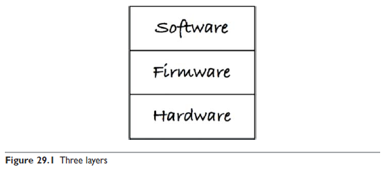
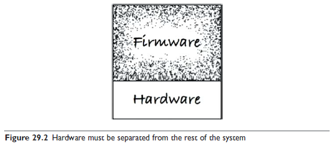
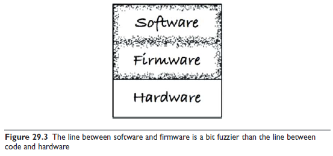
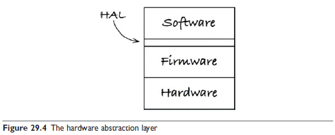
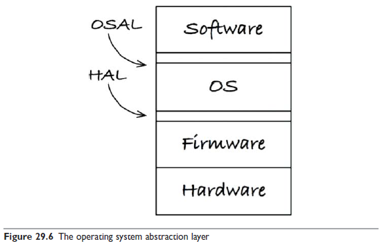

# 29장 클린 임베디드 아키텍처

> 소프트웨어는 닳지 않지만, 펌웨어와 하드웨어는 낡아 가므로 결국 소프트웨어도 수정해야 한다.

펌웨어와 하드웨어에 대한 의존성을 관리하지 않으면 안으로부터 파괴될 수 있다.  
잠재적으로 오래 살아남을 수 있던 임베디드 소프트웨어가 하드웨어 의존성에 오염되는 바람에 짧게 삶을 마감하는 일은 드물지 않다.  
따라서 임베디드 코드를 구조화할 수 있어야 한다.

당신도 코드에 SQL을 심어 놓거나 개발하는 코드 전반에 플랫폼 의존성을 퍼뜨려 놓는다면, 본질적으로 펌웨어를 작성하는 셈이다.

## 앱-티튜드 테스트

왜 잠재적인 임베디드 소프트웨어는 그렇게도 많이 펌웨어로 변하는가?  
임베디드 코드가 동작하게 만드는 데 대부분의 노력을 집중하고, 오랫동안 유용하게 남도록 구조화하는 데는 그리 신경 쓰지 않기 때문으로 보인다.

임베디드가 아닌 대다수의 앱들도 코드를 올바르게 작성해서 유효 수명을 길게 늘리는 데는 거의 관심 없이, 그저 동작하도록 만들어진다.

앱이 동작하도록 만드는 것을 저자는 개발자용 `앱-티튜드 테스트 App-titude test` 라고 부른다.

앱-티튜드 테스트를 통과한 애플리케이션은 동작한다. 하지만 이 애플리케이션이 클린 임베디드 아키텍처를 가진다고 말하기는 어렵다.

## 타깃-하드웨어 병목현상

임베디드 개발자들은 특수한 관심사를 많이 가지고 있다.  
제한된 메모리, 실시간성 제약과 처리완료 시간, 제한된 입출력, 특이한 사용자 인터페이스, 센서와 상호작용

임베디드 코드가 클린 아키텍처 원칙과 실천법을 따르지 않고 작성된다면  
대개의 경우 코드를 테스트할 수 있는 환경이 해당 특정 타깃으로 국한될 것이다.

### 클린 임베디드 아키텍처는 테스트하기 쉬운 임베디드 아키텍처다

#### 계층

맨 하단에는 하드웨어가 있다.  
하드웨어는 기술의 발전으로 변하고, 부품은 낡기 때문에 불가피하게 하드웨어를 변경해야 하는 시점이 닥치게 된다.  
이 상황에서 임베디드 엔지니어는 필요 이상의 작업을 하고 싶어하지 않는다.

무엇을 어디에 위치시킬지, 한 모듈이 다른 모듈에 대해 어디까지 알게 할지를 신중하게 처리하지 않는다면, 완성된 코드는 변경하기가 매우 어렵게 된다.

소프트웨어와 펌웨어가 서로 섞이는 일은 안티 패턴이다.

가벼운 변경에도 시스템 전체를 대상으로 회귀 테스트를 전부 실행해야 한다.  
기기를 외부적으로 테스트할 수 있게 구성하지 않았다면 지루한 수동 테스트를 비켜갈 방법이 없다.

#### 하드웨어는 세부사항이다

소프트웨어와 펌웨어 사이의 경계는 잘 정의하기가 대체로 힘들다.

임베디드 소프트웨어 개발자는 이 경계를 분명하게 만들어야 한다.  
이 경계를 하드웨어 추상화 계층(Hardware Abstraction Layer, HAL)이라고 부른다.

HAL은 자신보다 위에 있는 소프트웨어를 위해 존재하므로, HAL의 API는 소프트웨어의 필요에 맞게 만들어져야 한다.

펌웨어가 정보를 저장하는 기능을 가지고 있다면, 소프트웨어는 이 값이 플래시 메모리에 저장된느지, 이름/값 쌍으로 영속성 장치에 저장하는지, 클라우드에 저장하는지 전혀 신경쓰지 않도록 해야 한다.

### HAL 사용자에게 하드웨어 세부사항을 드러내지 말라

클린 임베디드 아키텍처로 설계된 소프트웨어는 타깃 하드웨어에 관계 없이 테스트가 가능하다.  
HAL을 제대로 만들었다면, HAL은 타깃에 상관 없이 테스트할 수 있는 경계층 또는 일련의 대체 지점을 제공한다.

#### 프로세서는 세부사항이다

프로세서 제작 업체가 제공하는 C 컴파일러는 종종 전역 변수처럼 보이는 것들을 제공하여 프로세서 레지스터, 입출력 포트, 클럭 타이머, 입출력 비트, 인터럽트 컨트롤러 및 프로세서 관련 나머지 함수들에 직접 접근할 수 있도록 해준다.

편리한 기능이지만, 이 기능을 사용해버리면 다른 프로세서에서는 컴파일되지 않을 것이고, 같은 프로세서라도 다른 컴파일러로는 컴파일하지 못할 수도 있다.

클린 임베디드 아키텍처라면 이런 기능을 사용하는 코드는 순전히 펌웨어로만 한정시켜야 한다.

펌웨어가 저수준 함수들을 프로세서 추상화 계층(Processor Abstraction Layer, PAL)의 형태로 격리시켜줄 수 있다.  
PAL 상위에 위치하는 펌웨어는 타깃-하드웨어에 관계없이 테스트할 수 있게 되어, 펌웨어 자체도 덜 딱딱해질 수 있다.

#### 운영체제는 세부사항이다

작성한 코드의 수명을 늘리려면, 무조건 운영체제를 세부사항으로 취급하고 운영체제에 의존하는 일을 막아야 한다.

클린 임베디드 아키텍처는 운영체제 추상화 계층(Operating System Abstraction Layer, OSAL)을 통해 소프트웨어를 운영체제로부터 격리시킨다.

OSAL은 테스트 지점을 만드는 데 도움이 되며, 소프트웨어 계층의 귀중한 애플리케이션 코드를 타깃이나 OS에 관계 없이 테스트할 수 있게 된다.

### 인터페이스를 통하고 대체 가능성을 높이는 방향으로 프로그래밍하라

모든 주요 계층 내부에는 이 책에서 설명한 원칙들을 적용해야 한다.  
이 원칙들은 관심사를 분리시키고, 인터페이스를 활용하며, 대체 가능성을 높이는 방향으로 프로그래밍하도록 유도한다.

계층형 아키텍처는 인터페이스를 통해 프로그래밍하자는 발상을 기반으로 한다.

클린 임베디드 아키텍처에서는 모듈들이 인터페이스를 통해 상호작용하기 때문에 각각의 계층 내부에서 테스트가 가능하다.  
각 인터페이스는 타깃과는 별개로 테스트할 수 있도록 해주는 경계층 또는 대체 지점을 제공한다.

### DRY 원칙: 조건부 컴파일 지시자를 반복하지 말라

## 결론

모든 코드가 펌웨어가 되도록 내버려두면 제품이 오래 살아남을 수 없게 된다.  
오직 타깃 하드웨어에서만 테스트할 수 있는 제품도 마찬가지다.