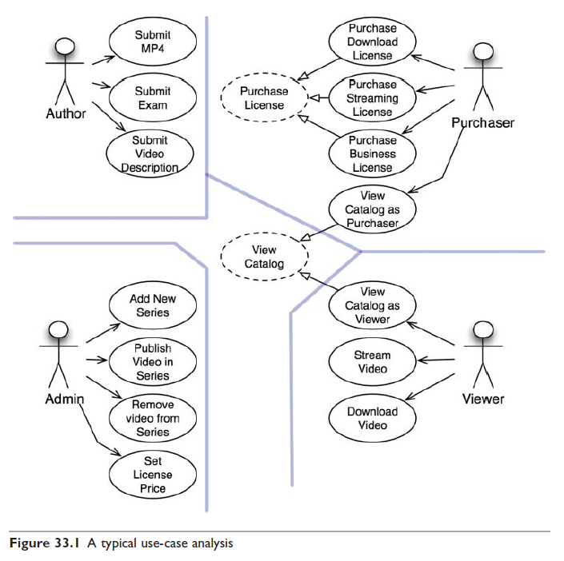
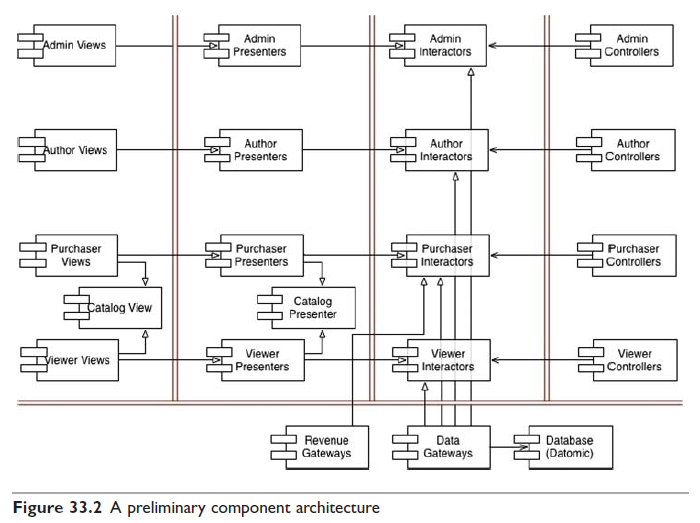

# 33장 사례 연구: 비디오 판매

지금까지 살펴본 아키텍처에 대한 규칙과 견해를 종합하여 사례 연구로 적용

## 제품

웹 사이트에서 비디오를 판매하는 소프트웨어

- 판매하길 원하는 비디오를 개인과 기업에게 웹을 통해 판매
- 개인은 단품 가격을 지불해 스트리밍으로 보거나 더 높은 가격으로 다운로드해서 영구 소장 가능
- 기업용 라이선스는 스트리밍만 가능
- 대량 구매 시 할인 가능
- 비디오 제작자는 비디오 파일과 설명서, 부속 파일(시험, 문제, 해법, 소스 코드 등) 제공
- 관리자는 비디오를 추가, 삭제, 라이선스에 맞게 가격 책정

## 유스케이스 분석

단일 책임 원칙에 따라 네 액터가 시스템이 변경되어야 할 네 가지 주요 원인이 된다.  
특정 액터를 위한 변경이 나머지 액터에게는 영향을 미치지 않도록 시스템을 분할해야 한다.

중앙의 점선으로 된 유스케이스는 범용적인 정책을 담은 추상 유스케이스다.

## 컴포넌트 아키텍처

이중으로 된 선은 아키텍처 경계를 나타낸다.  
뷰, 프레젠터, 인터랙터, 컨트롤러로 분리했다.

각 컴포넌트는 단일 .jar 파일 또는 .dll 파일

Catalog View와 Catalog Presenter는 카탈로그 조회하기라는 추상 유스케이스를 처리하기 위한 컴포넌트다.  
상속받은 뷰와 프레젠터 클래스에서 이것을 구체화할 것

뷰, 프레젠터, 인터랙터, 컨트롤러, 유틸리티 각각을 하나의 .jar 파일로 만들어 5개의 파일로 관리할 수도 있고, 뷰와 프레젠터를 합치고 인터렉터, 컨트롤러, 유틸리티는 개별 .jar 파일로 관리할 수도 있다.  
이처럼 선택지를 열어 두면 후에 시스템 변경 양상에 맞춰 배포 방식을 조정할 수 있다.

## 의존성 관리

제어흐름은 오른쪽에서 왼쪽으로 이동한다.  
대다수의 화살표는 왼쪽에서 오른쪽으로 향한다. (의존성 원칙)  
상속 관계는 제어흐름과 반대 방향을 가리킨다. (개방 폐쇄 원칙)

## 결론

단일 책임 원칙에 기반한 액터의 분리, 의존성 규칙을 적용했다.

이런 방식으로 구조화하면 시스템을 실제로 배포하는 방식은 다양하게 선택할 수 있게 된다.