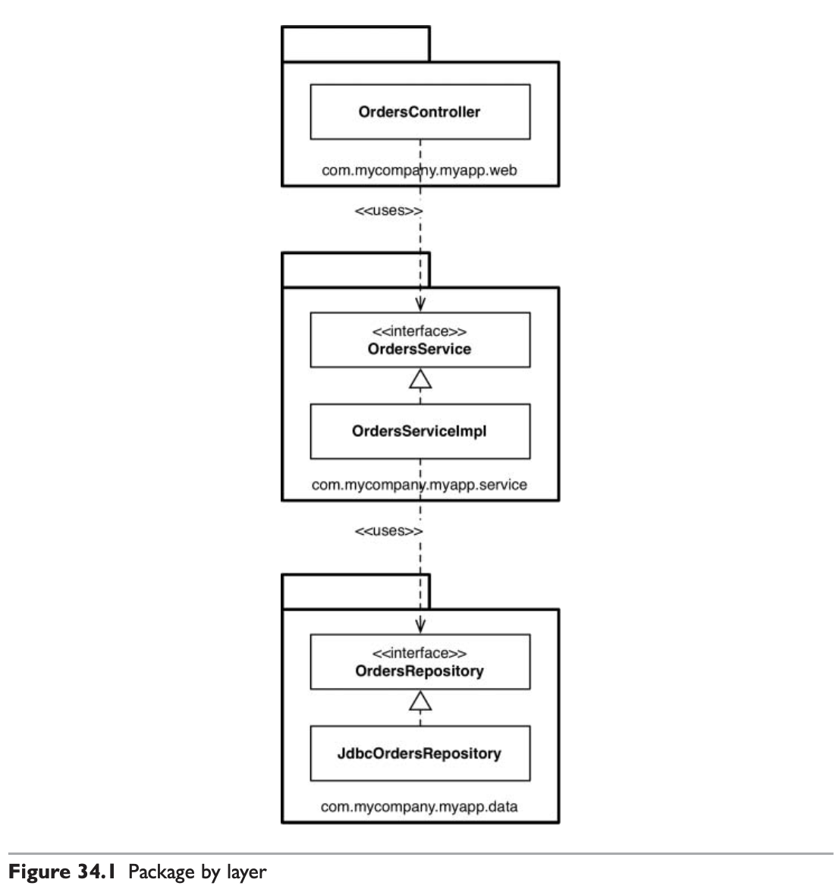
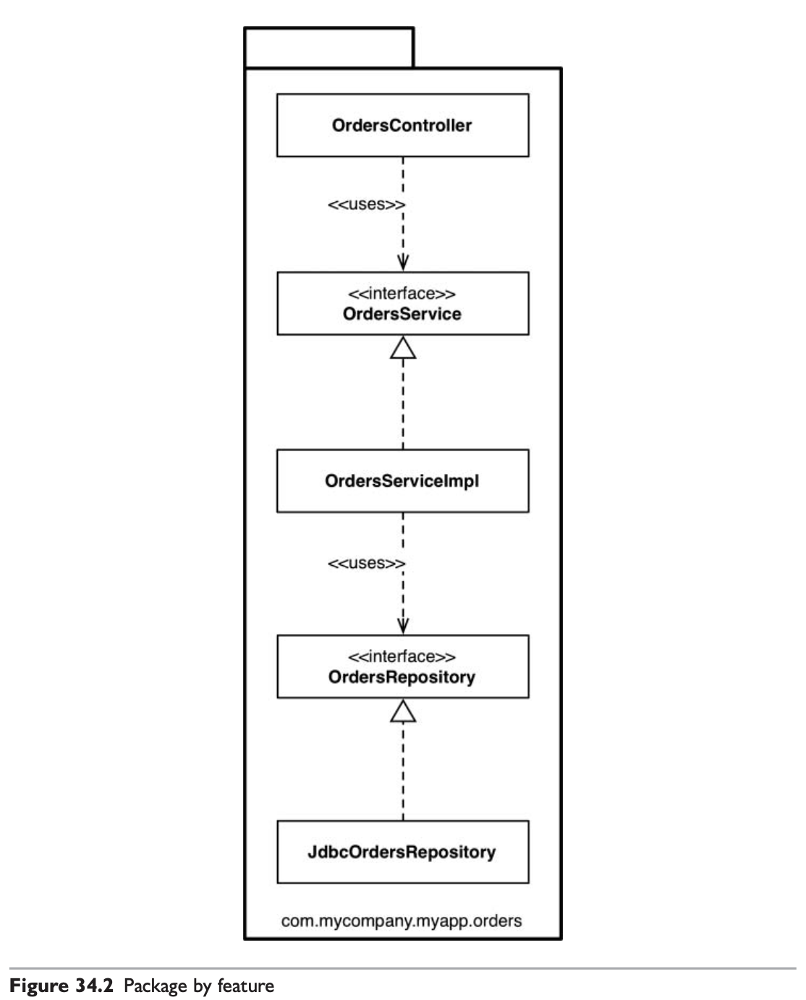
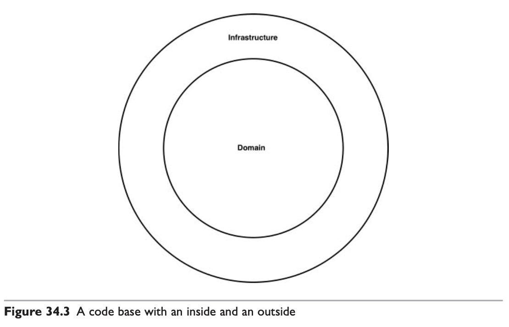
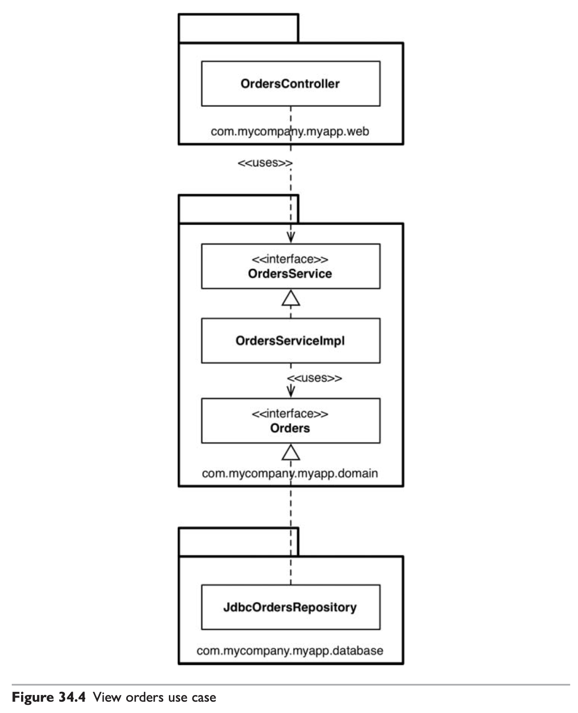
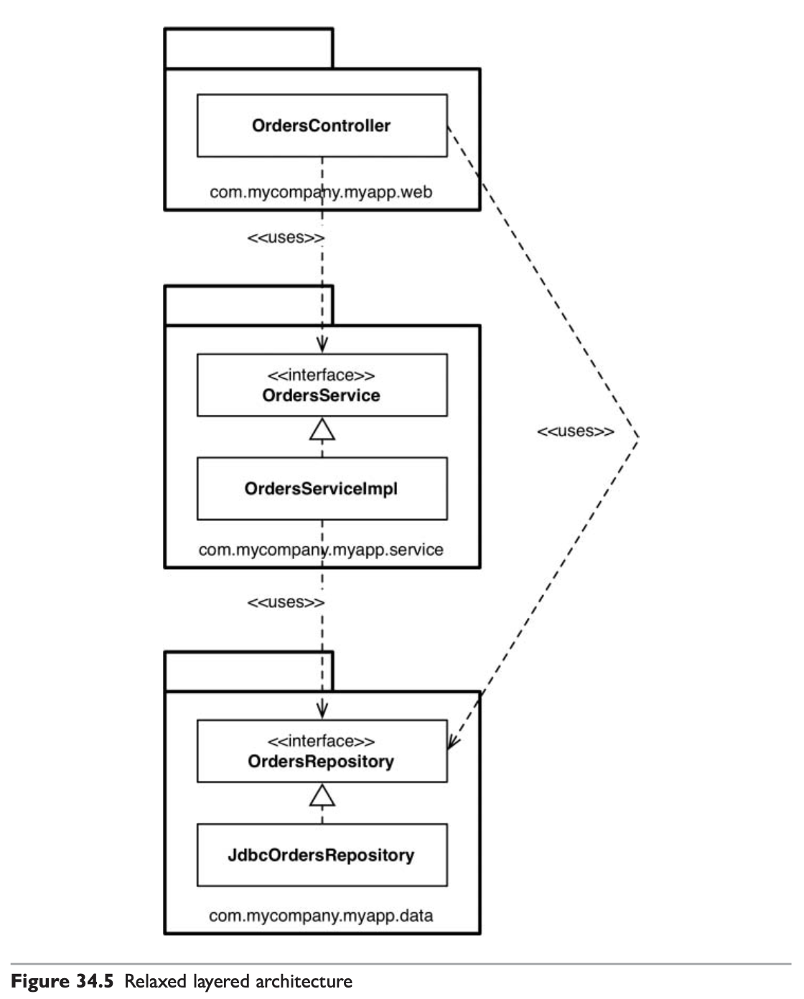
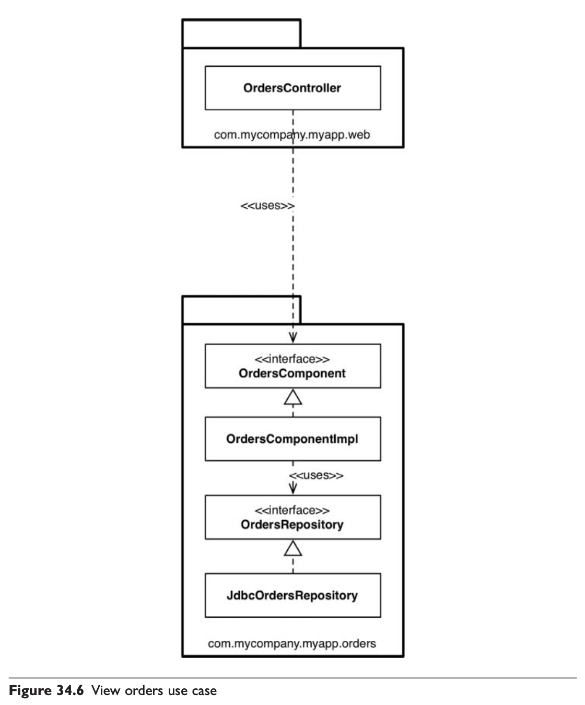
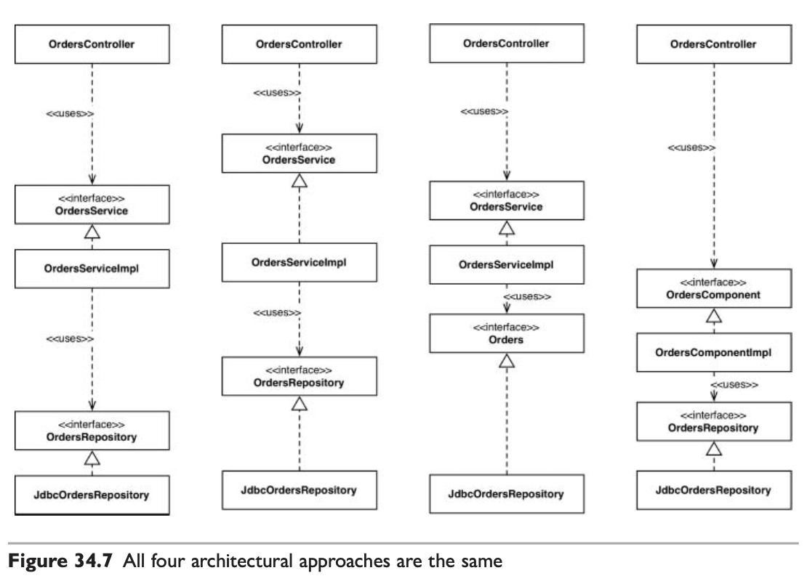
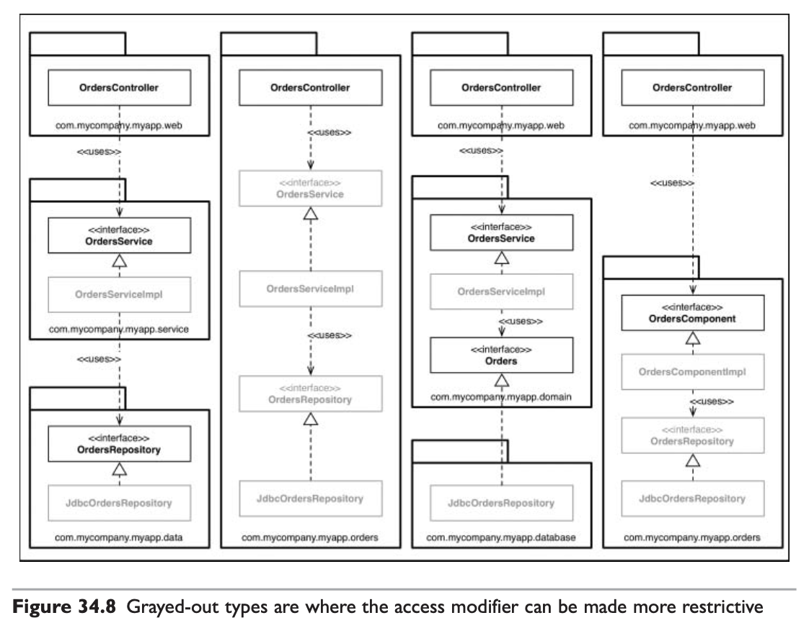

# 34장 빠져있는 장

클린 아키텍처는 잠시 한쪽으로 제쳐 놓고, 설계나 코드 조직화와 관련된 몇가지 접근법을 살펴보자.

## 계층 기반 패키지

전통적인 수평 계층형 아키텍처다.

- OrdersController: 웹 컨트롤러이며, 웹 기반 요청을 처리한다. Spring MVC 컨트롤러 등이 여기 해당
- OrdersService: 주문 관련 업무 규칙을 정의하는 인터페이스
- OrdersServiceImpl: OrderService의 구현체
- OrdersRepository: 영구 저장된 주문 정보에 접근하는 방법을 정의하는 인터페이스
- JdbcOrdersRepository: OrdersRepository의 구현체

마틴 파울러는 처음 시작하기에는 계층형 아키텍처가 적합하다고 이야기했다.  
많은 책과 교육 과정, 샘플 코드 또한 계층형 아키텍처를 선택한다.  
복잡함을 겪지 않고도 무언가를 작동시켜주는 아주 빠른 방법이기 때문.

하지만 계층형 아키텍처는 업무 도메인에 대해 아무것도 말해주지 않는 문제가 있다.

## 기능 기반 패키지

기능 기반 패키지는 서로 연관된 기능, 도메인 개념, 또는 Aggregate Root에 기반하여 수직의 얇은 조각으로 코드를 나누는 방식이다.

 
 Aggregate Root 란?

- Aggregate  
DDD(Domain-Driven Design)에서 강한 일관성을 하나의 트랜잭션으로 보장할 필요가 있는 객체의 묶음을 말한다.  
비즈니스적으로 함께 변경되어야 하고 함께 유효성이 검증되어야 하는 도메인 객체 그룹.

- Aggregate Root  
Aggregate 외부에서 내부로 접근 가능한 유일한 진입점.  
Aggregate 루트 외부에서는 Root만 직접 참조 가능  
내부 엔티티 접근, 수정, 삭제도 항상 Root 기준으로 수행되어 모델을 안전하게 유지함.

인터페이스와 클래스는 계층 기반 패키지와 같지만, 모두가 단 하나의 패키지에 속하게 된다.  
이제 코드의 상위 수준 구조가 업무 도메인에 대해 무언가를 알려주게 된다.  
드디어 우리는 이 코드 베이스가 주문과 관련한 무언가를 한다는 걸 볼 수 있다.

## 포트와 어댑터

엉클 밥에 따르면, 포트와 어댑터 혹은 헥사고날 아키텍처 등의 방식으로 접근하는 이유는 업무/도메인에 초점을 둔 코드가 프레임워크나 데이터베이스 같은 기술적인 세부 구현과 독립적이며 분리된 아키텍처를 만들기 위해서다.

코드 베이스는 내부(도메인)와 외부(인프라)로 구성됨을 흔히 볼 수 있다.  
여기서 주요 규칙은 바로 외부가 내부에 의존하며, 절대 그 반대로는 안 된다는 점이다.

OrdersRepository가 Orders라는 간단한 이름으로 바뀐 것은 중요한데,  
도메인 주도 설계라는 세계관에서 비롯된 명명법으로, DDD에서는 내부에 존재하는 모든 것의 이름은 반드시 '유비쿼터스 도메인 언어' 관점에서 기술하라고 조언하기 때문이다.

 
 유비쿼터스 도메인 언어란?

도메인 전문가, 기획자, 개발자가 서로 공유하며 사용하는 공통 언어

- 도메인 중심적: 도메인의 개념과 행동을 정확히 반영해야 함.
- 팀의 공유 언어: 모든 팀원이 이해하고 사용할 수 있어야 함.
- 코드와 문서화의 일관성: 코드, 테스트 케이스, 설계 문서에서 동일하게 표현됨.

## 컴포넌트 기반 패키지

저자는 엔터프라이즈 소프트웨어를 구축하는 데 대부분의 경력을 쏟았다. 그 과정에서 엄청나게 다양한 시스템을 경험했는데, 대다수가 전통적인 계층형 구조를 기반이었다.

엄격한 계층형 아키텍처에서는 의존성 화살표가 항상 아래를 향하며, 각 계층은 반드시 바로 아래 계층에만 의존해야 한다.  
하지만 계층형 아키텍처에서는 이런 실수가 자주 발생할 수 있다.

의존성 화살표는 여전히 아래를 향하지만, 이제 몇몇 유스케이스에서는 OrdersController가 OrdersService를 우회하고 있다.

CQRS 패턴을 지키려는 경우 이외의 경우에서는 업무 로직 계층을 우회하는 일은 바람직하지 못하다.  
이런 현상을 막기 위해서 빌드 시 정적 분석 도구(NDepend, Structure101, Checkstyle 등)을 사용하여 위반 사항이 없는지 검사할 수 있는데, 이러한 규칙들은 대체로 정규 표현식이나 와일드카드 문자열로 표현된다.

ex) **/web 패키지에 있는 타입은 절대로 **/data에 있는 타입에 접근해서는 안된다 등

효과 있는 방식이지만 조잡하고, 빌드 과정에서 알게되기 때문에 너무 늦다.

컴포넌트 기반 패키지를 도입해야 하는 이유가 여기에 있다.  
이 접근법은 큰 단위의 단일 컴포넌트와 관련된 모든 책임을 하나의 자바 패키지로 묶는데 주안점을 둔다.

이 접근법에서는 업무 로직과 영속성 관련 코드를 하나로 묶는데, 저자는 이 묶음을 컴포넌트라고 부른다.  
앞서 정의했던 컴포넌트의 정의

> 컴포넌트는 배포 단위다. 시스템의 구성 요소로서, 배포할 수 있는 최소 단위다. 자바의 경우 jar 파일

와는 다르게, '멋지고 깔끔한 인터페이스로 감싸진 연관된 기능들의 묶음'로 정의하겠다.

이 방법론에서 소프트웨어 시스템은 하나 이상의 컨테이너로 구성되며, 각 컨테이너는 하나 이상의 컴포넌트를 포함한다.

컴포넌트 기반 패키지 접근법의 주된 이점은 주문과 관련된 무언가를 개발할 때, OrdersComponent만 둘러보면 된다는 점이다.

## 조직화 vs. 캡슐화

public 타입을 코드 베이스 어디에서도 사용할 수 있다면 패키지를 사용하는 데 따른 이점이 거의 없다.  
public 지시자를 과용하면 이 장의 앞에서 제시한 네 가지 아키텍처 접근법은 본질적으로 완전히 같아진다.

^ public 접근지시자로 인해 네 개의 아키텍처 접근법이 모두 동일하다.

## 다른 결합 분리 모드

프로그래밍 언어가 제공하는 방법 외에도 소스 코드 의존성을 분리하는 방법은 있을 수 있다.  
자바에는 OSGi 같은 모듈 프레임워크가 있다.

다른 방법으로는 소스 코드 수준에서 의존성을 분리하는 방법도 있다.  
- 업무와 도메인용 소스 코드: OrdersService, OrdersServiceImpl, Orders
- 웹용 소스 코드: OrdersController
- 데이터 영속성용 소스 코드: JdbcOrdersRepository

웹용 소스 코드 트리와 데이터 영속성용 소스 코드 트리는 업무와 도메인 코드에 대해 컴파일 시점에 의존성을 갖는다.  
구현 관점에서 이렇게 분리하면 빌드 도구를 사용해서 모듈이나 프로젝트가 서로 분리되도록 구성해야 한다.

## 결론: 빠져 있는 조언

최적의 설계를 꾀했더라도, 구현 전략에 얽힌 복잡함을 고려하지 않으면 설계가 순식간에 망가질 수 있다는 점을 잊지 말라.

설계를 어떻게 해야 원하는 코드 구조로 매핑할 수 있을지, 코드를 어떻게 조직화할지, 런타임과 컴파일 타임에 어떤 결합 분리 모드를 적용할지를 고민하라.

가능하다면 선택사항을 열어두되, 실용주의적으로 행하라.

선택한 아키텍처 스타일을 강제하는 데 컴파일러의 도움을 받을 수 있을지를 고민하며, 데이터 모델과 같은 다른 영역에 결합되지 않도록 주의하라.  
구현 세부사항에는 항상 문제가 있는 법이다.